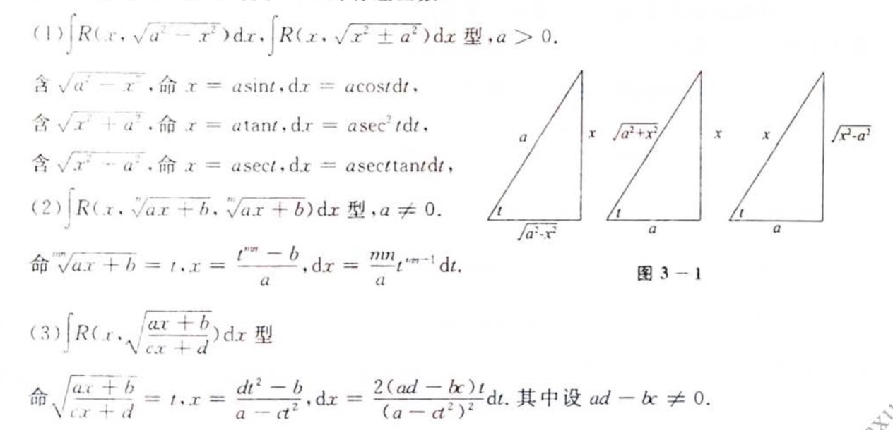
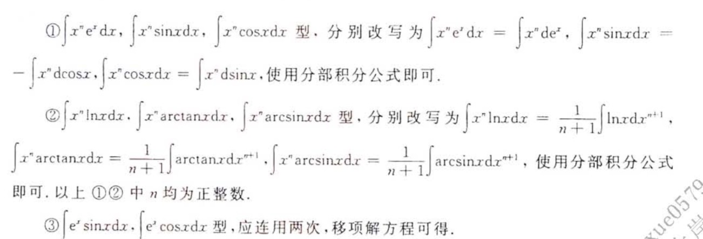
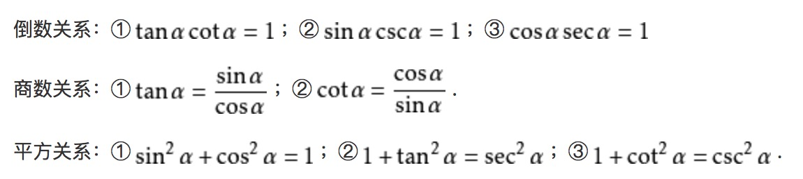
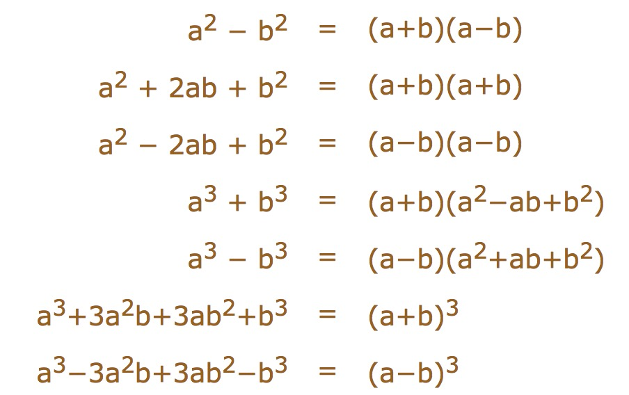

#### 奇偶性和周期性的推论

**原函数和被积函数的奇偶/周期性：**

* 1.F(x)是奇函数，f(x)是偶函数

* 2.F(x)是偶函数，f(x)是奇函数

* 3.F(x)是周期函数，f(x)是周期函数

反之，

* 1.f(x)是奇函数，F(x)是偶函数

* 2.f(x)是偶函数，有且仅有一个F(x)是奇函数。（常数C=0）

* 3.f(x)是周期为T的函数，F(x)是周期函数的充要条件：f在一个T定积分等于0

#### 定积分存在定理

* 1.被积函数连续，定积分一定存在
* 2.被积函数在[a,b]上有界，且只有有限个间断点，定积分存在

#### 原函数存在定理

* 1.被积函数连续，原函数一定存在（初等函数在其定义域内一定是连续的）
* 2.被积函数在定义域上有跳跃间断点，一定不存在原函数

>f(x)不连续，那么原函数是否存在和定积分是否存在互不相干

## 基本积分方法

* 1.凑微分
* 2.换元法

>定积分使用换元法时，需要关注上下限
* 3.分部积分法
```
常见的分布积分题型，一般是将f(x)与ex lnx 反三角函数结合
非常有用的积分公式：奇偶性/周期性/华里士公式 P86
```
c见分部积分法图


### 有理分式快速分解的方法

**基本原则**

<https://zhuanlan.zhihu.com/p/32236016>
<https://blog.csdn.net/sunbobosun56801/article/details/78592843>
<https://www.shuxuele.com/algebra/partial-fractions.html>. [这个可能是最容易理解的方式了]

### 不定积分的计算

* 1.如果分母不能被因式分解，那么拆项的时候，一项的分子为分母的导数，并且使得第二项的分子中只包含常数。 P87 例1
* 2.如果分母不能被因式分解，且分子是一个常数，凑平方
* 3.分母带根号的有三种解法：要么用最小公倍数去除根号，要么使用三角函数去除根号。三角函数一般是包含平方的：三种情况。参见P85 
  或者将根号内的内容配成**平方差**
* 4.P89 例4和例6 给出的三角积分的两种样例，记住
* 5.反三角函数+对数函数积分。一般将最复杂的部分直接替换。（对数/反三角函数部分设为U）例8 P90
* 6.有些分部积分，不必要立刻计算，因为可能被扣掉 P91 例10
* 7.积分包含高次项，传统的拆项很繁琐，可以使用“凑”即拆分子，看看能否约掉部分分母。P95 例17
* 8.高次的积分 需要考虑到tanx P95 例17
* 9.定积分：如果被积函数里既有x又有三角函数，除了用分部积分法，还可以使用换元法。消除x。P96 例18
* 10.P96 例9 很好解释了，不需要将所有积分都求出来

### 反常积分

什么是反常积分？
>两种情况：要么函数值出现无穷的情况（无界函数，奇点的位置比较隐晦，让人无法察觉这是一个反常积分，此处有埋伏），要么定义域出现无穷的情况（无穷区间）。

* 这里有个重要的反常积分 P100 
* 基础公式很重要 P100 例1 使用了两个基本的积分公式

### 定积分的证明题

* 1.讨论一个定积分的奇偶性，一般会用到换元法 P112 例1
* 2.积分不等式的证明有三个方法：

```
   a 使用微分学的方法（单调性/最值/拉格朗日/泰勒） 
   b 使用积分不等式 或者严格不等式 P78 定理3.1.6（7）
   c 使用计算。要么用积分中值定理，要么用变限积分将目标函数化成可以计算的式子
```
* 3.对于定积分和普通算式的比较，有两种处理措施：a 去除积分号：利用积分中值定理 b 添加积分号 将普通算式转变为变限积分 P113 例2
* 4.P113 例3 分区间套路。注意区间是怎么分的，绝对值符号又是怎么去的
* 5.对于包含三角函数的比较，优先考虑换元法 P115 例6


## 补刀点

1.常见三角函数的求导，对照着P84

2.常见的恒等式，用于因式分解 


```
a2 − b2	 = 	(a+b)(a−b)
a2 + 2ab + b2	 = 	(a+b)(a+b)
a2 − 2ab + b2	 = 	(a−b)(a−b)
a3 + b3	 = 	(a+b)(a2−ab+b2)
a3 − b3	 = 	(a−b)(a2+ab+b2)
a3+3a2b+3ab2+b3	 = 	(a+b)3
a3−3a2b+3ab2−b3	 = 	(a−b)3
```
3.多项式长除
<https://www.shuxuele.com/algebra/polynomials-division-long.html>


