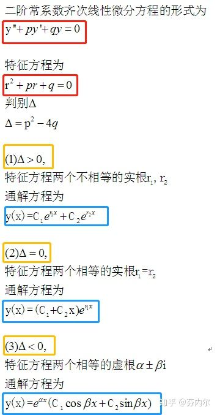
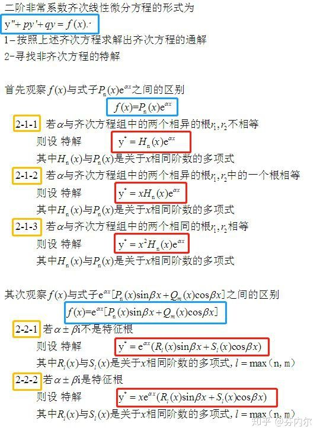

微分方程
### 一阶微分方程
1.可分离变量
2.齐次方程（公式怎么来的？）
3.线性方程（只含有导数的一次项，函数的一次项）

**解题关注点**

```
1.一阶微分方程的一阶是微分的次数，只有一次微分
2.一阶微分方程的解题方法有三大类：可分离变量 齐次方程 线性方程
3.齐次方程 y=ux 所以 dy/dx = u + x* du/dx 这个在求解中常用
4.解题步骤：
    a 是否有公因式，提取公因式后是否可以分离变量 P180 例1
    b 是否可以通过变量替换消除常数项 P181 例2
    c 是否已知类型，如果不是有两种常见方法，y看做自变量，x看作因变量 P181 例3
      变量代换 P182 例4
```    

### 可降阶的高阶微分方程
1.反复积分
2.不显含y
3.不显含x

### 高阶线性方程
**1.二阶常系数齐次线性微分方程**



**2.二阶常系数非齐次线性微分方程**




`齐次是根据特征方程来决定解`
`非齐次的通解，和齐次的解法一样`
`非齐次的特解本质是预先构造（猜想）一个类似的方程，然后求出系数`

**3.求特解的系数**

一般解法是将特解带入原微分方程，求出系数

```
拓展：这里代入原式，是有一定技巧的（ Q 为特解里的 P_n(x) ）
如果k = r1 = r2  则公式为 Q'' = P_n(x)
如果k = r1 !=r2 则公式为 Q'' + (2k-p)Q' = P_n(x)
如果k != r1 != r2，那就没有技巧了。
```

**4.解的结构**

三个概念：

    `y1是方程的解`

    `y = C1*y1 + C2*y2 是方程的通解`

    `y*是方程的特解`
    
相互之间的关系：

    `特解之差=齐次的解`
    
    `非齐次-特解=齐次的解`
    
    `非齐次的解的系数之和=0，则为对应齐次的解。之和=1，则还为非齐次的解 见引用2 解的性质`  
    
对于非齐次方程的解来说，有这样的结论，**重要**  
    
    ```
    1.解的系数之和=0，为对应齐次的解 P184 例12
    2.解的系数之和=1，为对应非齐次的解 P184 例11
    ```


**参考**
<https://zhuanlan.zhihu.com/p/25514827> <https://zhuanlan.zhihu.com/p/25518193> 
概念
<https://zhuanlan.zhihu.com/p/38573924> 
概念+特征方程的来源+**二阶非齐次的解的小技巧**
<https://zhuanlan.zhihu.com/p/41820091> 
特解思路+专栏中还有其他章节的内容+**二阶非齐次的解**


