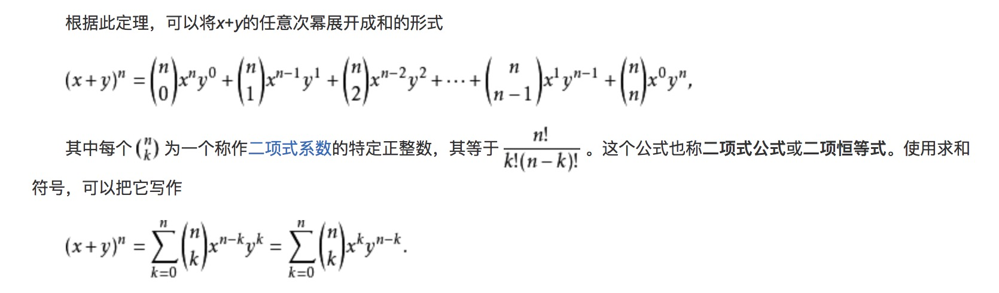

# 矩阵

## 1.基础知识

* 1.矩阵相乘 秩的不等式有三种 P213
* 2.初等变化（右乘A，|A|!=0）或者转置，秩不变
* 3.矩阵 乘法没有交换律也没有消去律。
* 4.行变化是左乘，列变化是右乘。

**[伴随矩阵]**

* 5.**A+B的转置=A的转置+B的转置，但可逆没该性质** P211
* 6.伴随矩阵的秩 = 原矩阵秩的n-1次方;伴随矩阵的伴随矩阵=? 可以利用 AA* = |A|E进行推倒
* 7.伴随矩阵的其他运算 P210 
 
  <http://www2.edu-edu.com.cn/lesson_crs78/self/j_0022/soft/ch0605.html>

**[可逆矩阵]**

  * 8.可逆矩阵 非奇异矩阵
  * 9.n阶矩阵A可逆的条件 
  
  ```
  1.|A|!=0 r(A)=n 矩阵行(列)向量无关 
  2.齐次方程组只有0解
  3.非齐次方程组只有唯一解
  4.A的特征值不全为0
  ```
  * 10.求可逆矩阵 P211
  
  ```
  1.公式 AA* = |A|E
  2.初等变换
  3.定义法 (估计也就是在求抽象矩阵的逆矩阵时候会用到)
  4.用分块矩阵
  ```
  
**[初等变换]**
  
  * 11.行变换就是左乘,列变换就是右乘.**左行右列**
  * 12.倍乘/互换/倍加 都属于初等变换,矩阵的秩不变

**[矩阵的秩]**

* 13.初等变换矩阵的秩不变
* 14.如果A可逆,则r(AB)=r(BA)=r(B) 完美对应了上一条:初等变换的秩不变
* 15.矩阵的秩和伴随矩阵的秩

```
1.如果A是满秩，那么其伴随矩阵也是满秩;
2.如果A（n阶矩阵）的秩是n-1，那么伴随矩阵的秩是1；
3.如果A的秩是小于n-1的话，伴随矩阵的秩是0.
```
* 16.A的转置矩阵的秩 = r(A);r(AA<sup>T</sup>)=r(A)
* 17.**r(A+B)<=r(A)+r(B)**
* 18.**r(AB)<= min(r(A),r(B))**
* 19.A<sub>m\*n</sub> B<sub>n\*s</sub> 若AB=O,则r(A)+r(B)<=n
* 20. r(A)=r(A<sup>T</sup>)=r(AA<sup>T</sup>)

**[分块矩阵]**

* 20.拉普拉斯矩阵的n次方
* 21.拉普拉斯矩阵的逆矩阵

## 2.做题规律
* 1.例1 矩阵乘法消去律和交换律失效的例子 记下来 
* 1.行矩阵A\*普通矩阵\*列矩阵（A的转置）= 一个数 .A是行向量 P216

```
为什么是一个数?
<http://www2.edu-edu.com.cn/lesson_crs78/self/j_0022/soft/ch0605.html>
矩阵与矩阵的乘法:
　设A<sub>m\*n</sub> B<sub>s\*n</sub>，，则A与B的乘积是这样一个矩阵：
　　(1) 行数与（左矩阵）A相同，列数与（右矩阵）B相同，即B<sub>m\*n</sub>．
　　(2) C的第行第列的元素由A的第行元素与B的第列元素对应相乘，再取乘积之和．
根据第一条规律,行矩阵A*B=C C的行数跟A相同,变成了一行.
C*A<sup>T</sup> 就成了一行*一列=一个数
```

* 2.行矩阵A\*列矩阵（A的转置）= 一个数  A是行向量
* 3.A\*A的转置 = A的转置\*A得到矩阵的迹 即主对角线元素之和 P216 
* 4.如果A是实对称矩阵,则A<sup>2</sup>=O

**[特殊矩阵的幂]**

* 4.A的任意两行/列成比例，A可以拆分成两个矩阵的积。用于求矩阵的幂 P218 
* 5.r(A)=1，A可以分解成两个矩阵的乘积，
  L=A的迹,主对角线只和
  A<sup>2</sup>=LA
  A<sup>N</sup>=L<sup>N-1</sup>\*A 
  
* 6.对于三角矩阵的幂可以考虑使用二项式来处理 P218 例8 
  二项式定理 
  <https://baike.baidu.com/item/%E4%BA%8C%E9%A1%B9%E5%BC%8F%E5%AE%9A%E7%90%86>
  
(a+b)<sup>3</sup>=a<sup>3</sup>+ 3a<sup>2</sup>b + 3ab<sup>2</sup> + b<sup>3</sup>
  
  同时 对于特殊类型如本例中的B 要记住 
  
**[可逆矩阵]**

* 7.两个矩阵相乘也可以看作是方程组 P223 例19
  所有方程组都可以看作是两个矩阵的乘积
  
* 8.可逆矩阵的题,如果包含多项式,可尝试根据方程组来求解 P224 例20
* 9.P219底部和P221的小结
* 10.擅于利用E=A\*A的逆 P224 例20
* 11.二阶矩阵的伴随矩阵,主对角线元素互换,副对角线变号  P220 例12

为什么初等行变换可以求出可逆矩阵?
https://zhuanlan.zhihu.com/p/30280309
其原理是基于下式（块矩阵乘法）：
A<sup>-1</sup>[A, E] = [E, A<sup>-1</sup>]

* 12.两个矩阵等价->通过初等变换可以相互转换->**秩相等**


数学参考网址:
http://www2.edu-edu.com.cn/lesson_crs78/self/j_4184/soft/ch0205.html


