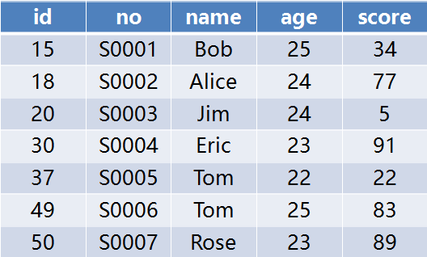

## RR与RC

数据库都会有事务隔离级别的概念：
* 1）未提交读（Read uncommitted）；
* 2）已提交读（Read committed（RC））；
* 3）可重复读（Repeatable read（RR））；
* 4）可串行化（Serializable）

我们较常使用的是RC和RR

## 千奇百怪的锁

InnoDB是一个支持行锁的存储引擎，锁的类型有：
* 共享锁（S）
* 排他锁（X）
* 意向共享（IS）
* 意向排他（IX）

**InnoDB有三种行锁的算法：**
* 1，Record Lock：单个行记录上的锁。基于索引的 有SX之分

* 2，Gap Lock：间隙锁，锁定一个范围，但不包括记录本身。GAP锁的目的，是为了防止同一事务的两次当前读，出现幻读的情况。有SX之分

* 3，Next-Key Lock：1+2，锁定一个范围，并且锁定记录本身。对于行的查询，都是采用该方法，主要目的是解决幻读的问题。有SX之分

```
由于可重读的隔离级别下，默认采用Next-Key Locks，就是Record lock和gap lock的结合，即除了锁住记录本身，还要再锁住索引之间的间隙，所以这个gap lock机制默认打开，并不会产生幻行
```

## 聚簇索引和二级索引
*MySQL 有两种索引类型：主键索引（Primary Index）和非主键索引（Secondary Index，又称为二级索引、辅助索引），
MyISAM 存储引擎对两种索引的存储没有区别，InnoDb 存储引擎的数据是保存在主键索引里的，非主键索引里保存着该节点对应的主键。
所以 InnoDb 的主键索引有时候又被称为 聚簇索引（Clustered Index），二级索引被称为 非聚簇索

* 二级索引的叶子节点中保存了主键索引的位置，在给二级索引加锁的时候，主键索引也会一并加锁

## 简单SQL的加锁分析

首先创建这样的表：


准备SQL：
```
聚簇索引，查询命中：UPDATE students SET score = 100 WHERE id = 15;
聚簇索引，查询未命中：UPDATE students SET score = 100 WHERE id = 16;
二级唯一索引，查询命中：UPDATE students SET score = 100 WHERE no = 'S0003';
二级唯一索引，查询未命中：UPDATE students SET score = 100 WHERE no = 'S0008';
二级非唯一索引，查询命中：UPDATE students SET score = 100 WHERE name = 'Tom';
二级非唯一索引，查询未命中：UPDATE students SET score = 100 WHERE name = 'John';
无索引：UPDATE students SET score = 100 WHERE score = 22;
聚簇索引，范围查询：UPDATE students SET score = 100 WHERE id <= 20;
二级索引，范围查询：UPDATE students SET score = 100 WHERE age <= 23;
修改索引值：UPDATE students SET name = 'John' WHERE id = 15;
```
  |case|lock-type|加锁索引|隔离级别|
  |---|---|---|---|
  |聚簇索引，查询命中|X锁|聚簇索引|RC/RR|
  |聚簇索引，查询未命中|GAP|聚簇索引|RR|
  |聚簇索引，查询未命中|none|none|RC|
  |二级唯一索引，查询命中|X锁|二级索引/主键索引|RC/RR|
  |二级唯一索引，查询未命中|GAP|二级索引|RR|
  |二级非唯一索引，查询命中|GAP/X锁|聚簇索引/二级索引|RR|
  |二级非唯一索引，查询命中|X锁|聚簇索引/二级索引|RC|
  |二级非唯一索引，查询未命中|GAP|二级索引|RR|
  |二级非唯一索引，查询未命中|none|none|RR|
  |无索引|X锁|所有记录|RC|
  |无索引|GAP/X锁|所有记录|RR|
  |聚簇索引，范围查询|X锁|范围内的所有记录|RC|
  |聚簇索引，范围查询|GAP/X锁|范围内的所有记录及周围记录|RR|
  |二级索引，范围查询|X锁|范围内的所有记录|RC|
  |二级索引，范围查询|GAP/X锁|范围内的所有记录及周围记录|RR|
  
> 为什么非唯一索引会加 GAP 锁，而唯一索引不用加 GAP 锁呢？
  原因很简单，GAP 锁的作用是为了解决幻读，防止其他事务插入相同索引值的记录，
  而唯一索引和主键约束都已经保证了该索引值肯定只有一条记录，所以无需加 GAP 锁
  
  
> 不加索引简直就是灾难。。。。。


[Reference]http://www.aneasystone.com/archives/2017/12/solving-dead-locks-three.html
[Reference]http://hedengcheng.com/?p=771