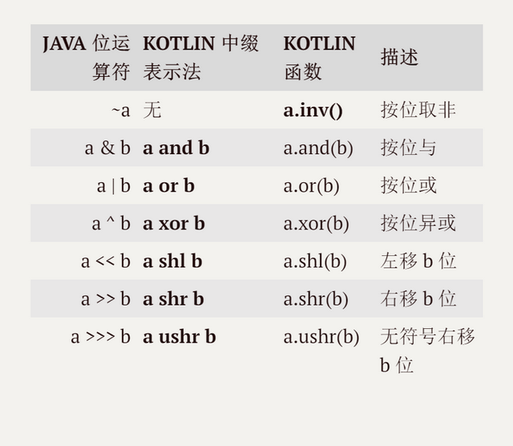

# 程序结构

## 变量和常量

Kotlin中如何声明一个变量呢？
`val|var 变量名[: 变量类型][= 初始化赋值]`

1.val 或 var：不可省略

**建议尽量使用 val，能不使用 var 就不使用 var**

2.变量名：不可省略

3.[: 变量类型]：当有初始化赋值时可省略
如果没有指定数据类型，Kotlin 会根据后面的初始化赋值自动推断数据类型
```kotlin
//定义一个 Kotlin.Int 类型的变量并赋为 1，这个类型对应 Java 中的 int 类型
val intKotlin: Int = 1
val intJava: int //编译错误，不能定义为 Java 中的基本数据类型
val listJava: List<String> //定义一个 Java 中的引用类型变量
val intInfferred = 1 //根据赋值自动推断为 Kotlin.Int 类型
```

4.[= 初始化赋值]：当指定了数据类型时可省略

注意kotlin中val跟final并不等价。
Java中的final是编译期常量。kotlin的变量使用`const`修饰才是编译期常量。


**参考**
https://zhuanlan.zhihu.com/p/26483807

## 函数 Function

Kotlin中函数的完整定义方式是：
`[访问控制符] [修饰符] fun [<泛型标识符>] [扩展接收类型.]函数名([参数列表])[: 返回值类型]{
  函数体
}`

1.[访问控制符]：可省略。
Kotlin 中的访问控制符有四个：public 、protected 、internal 、private，如果没有声明，则默认为 public

2.[修饰符]：可省略。
这些修饰符会给函数添加不同的功能，包括 infix 和 inline。

3.fun：不可省略。
这是用来声明函数的关键字，是英语 Function（函数）的缩写

4.函数名：不可省略。函数可以赋值给一个变量，那么变量就是函数的名字了
```kotlin
val int2Long = fun(x: Int): Long {
    return x.toLong()
}
```

5.[<泛型标识符>]：可省略。
与 Java 类似，如果返回值包含泛型，则需要在这里将函数标记为泛型函数。
```kotlin
//定义一个函数，输入一个元素，输出一个只包含这个元素的 List
fun <T> singletonList(item: T): List<T> = listOf(item)
```

6.[扩展接收类型.]：可省略
7.[参数列表]：可省略

8.[: 返回值类型]：可省略
如果一个函数没有返回值，则它的返回值类型是 Unit，一般会省略.Unit相当于java中void
```kotlin
//这里的 :Unit 一般省略
fun sayHello(name: String): Unit = println("My name is ${name}.")
```
如果返回值类型可以由单句的函数体推断出来，则可以省略返回值类型。
```kotlin
//推断出返回值类型是 Double，可以省略 :Double 声明
fun multiply(a: Double, b: Double) = a * b
```

9.{函数体}：不可省略

**参数列表详解**

1.默认参数
给参数一个默认值。大大减少了方法的重载。
```kotlin
//输入两个或三个 Int 变量，返回它们的和
fun add(a: Int, b: Int, c: Int = 0) = a + b + c
println(add(3, 1)) //默认 c 为 0，输出 4
println(add(3, 1, 2)) //输入 c 值，不使用默认值，输出 6
```

2.可变数量参数
使用 **vararg** 修饰参数列表的最后一项，表示这个参数的数量是可变的，与 Java 中的“`形参类型.. 形参名`”相同

```kotlin
fun add(a: Int, b: Int, vararg n: Int): {
    var sum = a + b
 // n 是 IntArray 类型，i 自动推断为 Int 类型，使用 in 遍历 n 中的元素
    for (i in n) {
      sum += i
    }
    return sum
}
```

**参考**
https://zhuanlan.zhihu.com/p/26494541

## Lambda表达式

Lambda表达式就是匿名函数。

```kotlin
//定义
val sum = { arg1: Int, arg2: Int ->
    println("$arg1 + $arg2 = ${arg1 + arg2}")
    arg1 + arg2
}
// 调用
//    println(sum(1, 3))
//    println(sum.invoke(1, 3))
```

下面举个例子解构一下lambda
```kotlin
//1.初始版本的循环
args.forEach({it -> println(it)}) //forEach是个高阶函数及参数或者返回值也能是函数，
                                  //forEach的入参是个函数 (T)-> Unit 这是函数的类型

//2.第二版本的循环
args.forEach({println(it)}) //传入的参数如果只有一个，可以省略不写

//3.第三版本的循环
args.forEach(){println(it)} //参数最后一个是lambda的话，可以将大括号移到小括号的外面

//4.第四版本的循环
args.forEach{println(it)} //参数列表为空，小括号可以省略

//5.第五版本的循环
args.forEach{::println} //传递的是一个函数名
```

中断forEach中的迭代
```kotlin
args.forEach ForEach@{ //设置标签
   if(it == "q") return@ForEach //返回指定位置
   println(it)
}
```

函数是有类型的，java里面所有的类型都有相对应的Class或者Interface
函数既然有类型，所以也有对应的Class定义
```
Kotlin 定义了 kotlin.Function<out R> 接口来抽象所有的函数，它没有定义任何方法。关键在这里：kotlin.jvm.functions 包里定义了 Function0<out R> 到 Function22<out R> 来分别抽象无参到 22 个参数的函数，它们都继承了 kotlin.Function 接口，同时定义了一个 invoke() 函数
```

```kotlin
interface Function2<in P1, in P2, out R> : Function<R> {
  operator fun invoke(p1: P1, p2: P2): R
}
```

invoke() 函数定义了“调用”这个行为，它同时重载了括号操作符( () )，允许我们用括号来传入参数、得到返回值

**参考**
https://zhuanlan.zhihu.com/p/27034675 

## 类和构造函数

### 1.构造函数的语法
```kotlin
class 类名[主构造函数][{
  //类成员
}]
```
要创建一个类的实例，只需要调用类的构造函数，**不使用 new 关键字**：

```kotlin
val s = StringBuilder("Hello World")
val list: List<String> = ArrayList()
```

### 2.主构造函数

先看个Java类的例子

```java
public class Person {
    String name;
    public Person(String name) {
        this.name = name;
    }
}
```

对应的Kotlin的版本

```kotlin
class Person constructor(name: String) {
    val name: String
    init {
        this.name = name
    }
}
```
首先，我们使用 **class** 定义了一个类 Person，然后在类头用 **constructor** 关键字定义带有一个 String 类型参数的主构造函数。在类体里，我们定义了一个不可变的 String 类型成员变量 name，然后使用**init 关键字定义主构造函数的行为**，把主构造函数的 name 参数赋给成员变量 name。
实际上可以简写成一行

```kotlin
class Person(val name: String)
```

* 1.如果主构造函数没有任何修饰符，则可以去掉 constructor 关键字
* 2.如果主构造函数中定义的参数使用 val 或者 var 修饰，则会创建与这个参数同名的成员变量，并使用传入的参数值初始化这个成员变量

### 3.次要构造函数

* 1.如果类已经有了一个主构造函数，那么所有的次构造函数都要直接或间接地委托给主构造函数
  次要构造函数的写法：
  ```kotlin
  constructor([参数列表]): this([参数列表]) {/*……*/}
  ```
* 2.次构造函数不能在参数列表中声明并初始化成员变量


**参考**
[类和构造函数](https://zhuanlan.zhihu.com/p/26659116)

## 属性

Kotlin的属性会比Java复杂一些：

1.Kotlin 中允许 **包级属性** 的存在，即属性不一定在类里；

2.所有非抽象属性都强制要求初始化，没有初始化的属性无法通过编译（除标记为 lateinit var 的属性外）

3.标准化的 getter 和 setter

4.大量的高级属性修饰符


### 类属性
定义类属性的语法
```kotlin
[修饰符] val|var 属性名[: 属性类型][= 初始化语句]
    [get() = getter 语句]
    [set() = setter 语句]
```

1.**属性不能缺少初始化语句，要么写在定义属性的地方，要么写在 init 语句里，否则就会编译错误**；

2.**标记为 val 的属性不能有自定义的 setter**

3.**Kotlin 中的“对象.属性”会视情况自动编译为调用 getter 或 setter 方法**

Kotlin 允许属性添加自定义的 getter 和 setter

```kotlin
class Person(name: String) {
    var name = name
        set(value) {
            field = if (value.isEmpty()) "" else value[0].toUpperCase() + value.substring(1)
        }

    val isValidName
        get() = !name.isEmpty()
}
```

1.需要自定义 setter 或 getter 的属性，不能放在类头里定义，必须在类体内定义

2.getter 是一个没有参数、返回类型与属性类型相同的函数,不能在 getter 里再调用本属性，因为 Kotlin 代码里所有对属性的访问都会被编译为 getter 方法，这样写就会出现无限迭代和 StackOverFlowError

3.setter 的参数列表一般有一个与属性类型相同的参数，没有返回值。

### 类外属性
在 Kotlin 类外定义的属性有两种，

一是直接写在类外并初始化的包级属性，
二是使用 const val 定义的 **编译期常量**


###  lateinit 修饰符

允许属性在创建的时候不进行初始化

```kotlin
class Person(val name: String) {
    lateinit var hello: String
    fun initHello() {
        hello = "Hello, my name is $name"
    }
}
```

**如果调用了未初始化的 lateinit 属性，就会抛出 UninitializedPropertyAccessException**
lateinit只能修饰**var**，那对于val也想延迟初始化怎么办呢

```koltin
class A{
    var b = 0
    lateinit var d: X
    val e: X by lazy {
        println("init X")
        X()
    }
    var cc: String? = null
}
```

### Kotlin 中去除的类属性关键字

transient：这个关键字表示该属性是「瞬时」的，不参与类的序列化。Kotlin 中用 @Transient 标注；

volatile：这个关键字用于多线程，可以视为「轻量化的 synchronized」。Kotlin 中用 @Volatile 标注。

### 幕后字段和 field
举个例子
```kotlin
class Person(val name: String) {
  val nameHash get() = name.hashCode()
}
```
这个 nameHash 属性并没有初始化，只定义了一个 getter 方法。这个属性在编译之后就会消失，只留下一个 getNameHash() 方法

```kotlin
public final int getNameHash() {
  return name.hashCode();
}
```

我们可以这样说：「nameHash 是一个没有幕后字段的属性」，它**作为类属性只存在于 Kotlin 代码中，并没有一个真正的 JVM 类属性与之对应**。怎么给 nameHash 添加一个幕后字段呢？Kotlin 并不允许我们手动添加，但会自动为满足条件的类属性添加幕后字段：

```
使用默认 getter / setter 的属性，一定有幕后字段。对于 var 属性来说，只要 getter / setter 中有一个使用默认实现，就会生成幕后字段；

在自定义 getter / setter 中使用了 field 的属性，一定有幕后字段。这个 field 就是我们访问幕后字段的「关键字」，它与 Lambda 表达式中的 it 类似，并不是一个真正的关键字，只在特定的语句内有特殊的意思，在其他语句内都不是关键字。
```

**参考**
[属性](https://zhuanlan.zhihu.com/p/26659166)
[深入理解Kotlin属性](https://zhuanlan.zhihu.com/p/27493630)


## 运算符
Kotlin 重载了很多运算符。运算符的本质就是一个函数。
>在Kotlin中方法指的是类成员，由类定义，通过对象调用。Java中只有方法，没有函数。因为函数可以不依赖于类而存在。

### Kotlin中与 Java 使用有差异的运算符

1.kotlin中的**==**是**equal**的重载，相比较地址值需要使用`===`

2.[]使用在数组变量后，**也可以用在集合变量后**，可以方便地调用和操作数组和集合中的元素。

### Java 中没有而 Kotlin 中有的运算符

1.is 和 !is
两个运算符相当于 Java 中的 instanceof 运算符，用于检查对象是否是某个类的实例

2.in 和 !in
a in b 重载为 b.contains(a)
```koltin
val b = arrayOf(1, 2, 3)
for(a in b) println(a)
```

3.a .. b 重载为 a.rangeTo(b)，返回一个从 a 到 b 的 区间，a 和 b 这两个边界也包含在内。这里的 a 和 b 要求都是整数，而且 a <= b
```kotlin
for(i in 1..10) println(i) //输出从 1 到 10 的整数
```

[Kotlin中的运算符](https://zhuanlan.zhihu.com/p/26546977)

## 表达式

### 中缀表达式

中缀表示法 是 Kotlin 定义的一种特殊的函数调用方式，标记为 infix ，并且只有一个参数的扩展函数或成员函数，可以使用这种表示方法。


### 分支表达式

#### 1.if具有返回值

```kotlin
  val mode = if(args.isNotEmpty() && args[0] == "1"){
        DEBUG
    }else{
        USER
    }
```
还可以简写

```kotlin
fun max(a: Int, b: Int) = if(a <= b) b else a
```

#### 2.when表达式

常见的用法

```kotlin
fun main(args: Array<String>) {
    val x = 5
    when(x){
        is Int -> println("Hello $x")
        in 1..100 -> println("$x is in 1..100")
        !in 1..100 -> println("$x is not in 1..100")
        args[0].toInt() -> println("x == args[0]")
    }

    val mode = when{
        args.isNotEmpty() && args[0] == "1" -> 1
        else -> 0
    }.let(::println)
}
```

```kotlin
    enum class State {
       IDLE, BUFFERING, PLAYING, PAUSED
    }
    
    private var state = State.IDLE
    
    fun pause() {
       when (state) {
           PlayerKt.State.BUFFERING, PlayerKt.State.PLAYING -> doPause()
           else -> {
           }
       }
    }
    
    fun resume() {
       when (state) {
           PlayerKt.State.PAUSED -> doResume()
       }//什么都不做
    }
```

### 循环语句

#### for循环

1.遍历数组或者集合的**内容**
```kotlin
val arrayInt = intArrayOf(1, 2, 3, 4, 5)

for (item in arrayInt) {
  println("$item")
}
```

2.遍历数组或集合的**索引**
```kotlin
for (i in arrayInt.indices) {
  println("arrayInt[$i] is ${arrayInt[i]}")
}
```

3.遍历数组或集合的**索引和内容**
```kotlin
for ((index, value) in arrayInt.withIndex()) {
  println("arrayInt[$index] is $value")
}
```

区间的遍历
```koltin
for (i in 1..5) println(i) //输出 1 到 5 的数字

for (i in 5 downTo 1) println(i) //输出 5 到 1 的数字

for (i in 1..5 step 2) println(i) //输出 1 3 5
```

### 返回和跳转

和 Java 相同，Kotlin 中有三个用来跳转的关键字：**return**、**break** 和 **continue**。

Kotlin 中的标签可以用在任何表达式前，格式如下：
`标签名@ 表达式  //标签名为合法的标识符，与变量名和函数名格式相同`

```kotlin
loop@ for (i in 1..10) {
  for (j in 1..10) {
    if(...) break@loop //终止 i 循环
  }
}
```
如果我们不使用 loop 标签，break 将会终止 j 的循环，这点和java一样，标签是用于跳出指定的循环。
**但 Kotlin 标签的强大之处在于它还可以控制 return 的返回对象**

```kotlin
ints.forEach lit@{
  if(it == 2) return@lit
  println(it)
}
```
序运行到 it = 2 时，会直接返回到 lit 标签标记的函数开始处，继续下一次遍历，输出 1 和 3 。
Kotlin 为了简化程序，会给每个高阶函数添加一个 隐式标签，这个标签与函数同名，上面的程序可以写为：

```kotlin
ints.forEach {
  if(it == 2) return@forEach
  println(it)
}
```

此外，如果 return 后有返回值，再加标签就要写成 return@标签 返回值 的形式：

```kotlin
return@loop 1 // 返回值 1 到 loop 标记的函数处
```

## 异常捕获

跟java别无二致
```kotlin
 try {
   val arg1 = args[0].toInt() //1
   val arg2 = args[1].toInt() //2a
   println("$arg1 + $arg2 = ${sum(arg1, arg2)}")
}catch (e: NumberFormatException){
   println("您确定输入的是整数吗？")
}catch (e: ArrayIndexOutOfBoundsException){
   println("您确定输入的是两个整数吗？")
}catch (e: Exception){
   println("程序出现了未知异常，可能是您的人品太差了。${e.message}")
}finally {
   println("谢谢您使用我们的加法计算器")
}
```

## 具名参数

给函数的形参附上实参。举例：

```kotlin
fun sum(arg1:Int,arg2:Int) = arg1 + arg2
//具名参数如下,参数顺序可变
sum(arg2=2,arg1=1)
```
## 变长参数


变长参数的长度是可变的，相当于数组，使用vararg关键词表示，
在函数的参数中，若变长参数不是最后一个，
在调用该函数的时候，非变长参数的参数需使用具名参数，
也就是要明确指定其他参数的名称

```kotlin
fun main(vararg args: String) {
    for (arg in args) {
        println(arg)
    }

    hello(3.0, 1, 2, 3, 4, string = "Great") //参数string需明确指定参数名

    val array = intArrayOf(6,7,8,9)
    hello(4.0, *array, string = "never") 
    //用*号将array数组传给变长参数，变长参数只支持array，不支持list
    //* 表示将array展开
}

fun hello(num: Double, vararg ints: Int, string: String) {
    ints.forEach(::println)
}
```

## 默认参数

很简单 看个例子就懂了
```kotlin
fun hello(double: Double, vararg ints: Int, string: String = "Hello"){
    println(double)
    ints.forEach(::println)
    println(string)
}
```

