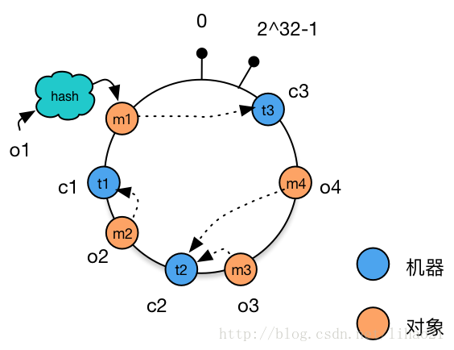

### 什么是一致性Hash？


### 应什么问题而生？
传统的Hash算法在node较少或者增加的时候，命中的概率将大大较少。
为了解决这个问题，一致哈希应运而生。

### 原理

**算法过程**：首先得有个一致性hash环
```
1.将data放在hash环上
2.将node放在hash环上
3.为data选择node，比如顺时针选择最近的node
```


思考：
一致性哈希实际上给的data和node在hash环相对位置。
外加一条规则：顺时针方向最近的node就是数据的位置。
这样，node的变化，不再会导致数据丢失。

[reference]https://blog.csdn.net/lihao21/article/details/54193868
