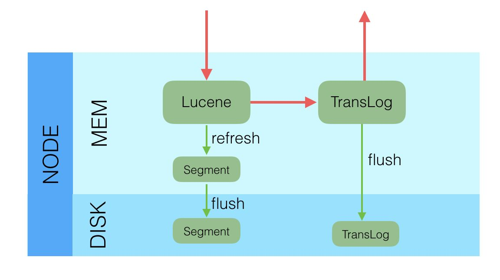

# Elasticsearch

1.es为什么查询那么快

2.常见的优化策略 segment DocValue Merge 策略 时序场景


## source和docValue
倒排索引的特点很明显，就是为了全文检索而生的，但是对于一些聚合查询（排序、求平均值等等）的场景来说，显然不适用。那么这样一来我们为了应对一些聚合场景就需要结构化数据来应付，这里说的结构化数据就是『列存储』，也就是上面说的doc_value

## 写入
1.局部更新：根据ID从Segment段中获取完成的Doc，然后合并，插入新的，删除旧的。`本质还是删除，重新索引`

2.更新时。更新请求被主分片处理成Index或者Delete请求。主分片处理完后，会将对应的Index或者Delete请求转发给副本。


3.数据的写入。先创建索引写入内存，然后写Translog。将Translog Flush到硬盘上，返回成功。

4.数据写入内存后，并不可读。Refresh把内存的对象转成完整的Segment后，然后再次reopen后才能被搜索，一般这个时间设置为1秒钟。

5.查询方式是GetById，这种查询可以直接从TransLog中查询，这时候就成了RT（Real Time）实时系统

## 查询
1.GetById 因为查询的是TransLog`包含内存和硬盘`，所以是事实的

2.search 需要搜索的Segment。但是Segment需要内存的数据刷新到Segment后，才可用。一般一秒一刷。

3.一般情况，ES查询分为两部分，query和fetch，因为一次doc全量数据拿过来，太消耗资源，所以query阶段的产出物是ID，fetch阶段才去真实的去拿数据

## 数据模型

Invert Index：倒排索引，或者简称Index，通过Term可以查询到拥有该Term的文档。可以配置为是否分词，如果分词可以配置不同的分词器。

DocValues：正排索引，采用列式存储。通过DocID可以快速读取到该Doc的特定字段的值。由于是列式存储，性能会比较好。一般用于sort，agg等需要高频读取Doc字段值的场景。

Store：字段原始内容存储，同一篇文章的多个Field的Store会存储在一起，适用于一次读取少量且多个字段内存的场景，比如摘要等。

>Lucene中提供索引和搜索的最小组织形式是Segment，Segment中按照索引类型不同，分成了Invert Index，Doc Values和Store这三大类

Q1:Lucene是一个单机的搜索库，如何能以分布式形式支持海量数据?
<br> 通过ID路由。让数据分布到不同的分片上

Q2:Lucene中没有更新，每次都是Append一个新文档，如何做部分字段的更新？
<br>先删除然后再次索引

Q3:Lucene中没有主键索引，如何处理同一个Doc的多次写入？
<br>  `_id`。Doc的主键，在写入的时候，可以指定该Doc的ID值，如果不指定，则系统自动生成一个唯一的UUID值。
>_uid的格式是：type + '#' + id。 ES6.0后一个索引只允许一个type所以id基本跟uid一致、

Q4:在稀疏列数据中，如何判断某些文档是否存在特定字段？
<br> 

Q5:Lucene中生成完整Segment后，该Segment就不能再被更改，此时该Segment才能被搜索，这种情况下，如何做实时搜索？
<br>根据ID查询

## ES分布式一致性原理剖析-1

1.选举。配置文件，配置了哪些节点有选举资格

2.选票策略。
<br>clusterStateVersion越大，优先级越高。`这是为了保证新Master拥有最新的clusterState(即集群的meta)`
<br>clusterStateVersion一致的时候。节点的Id越小，优先级越高。

3.选举策略。

```
    A认为B是master。A向B发送join请求
    B如果是master，那么将A纳入集群
    B如果是竞选master，那么A的join就是一次选票
    B如果不是master（比如是data节点），B会拒绝A的join。A重新选举。
    B收到半数以上节点的选票，B认为成为master，更新cluster_state，并向其他节点广播
```

4.脑裂

```
因为上述流程并没有限制在选举过程中，一个Node只能投一票，那么什么场景下会投两票呢？比如NodeB投NodeA一票，但是NodeA迟迟不成为Master，NodeB等不及了发起了下一轮选主，这时候发现集群里多了个Node0，Node0优先级比NodeA还高，那NodeB肯定就改投Node0了。假设Node0和NodeA都处在等选票的环节，那显然这时候NodeB其实发挥了两票的作用，而且投给了不同的人
```

## ES分布式一致性原理剖析-2

1.master靠广播ClusterState通知其他节点管理集群 `创建或者删除index，Shard进行重新调度，实现负载均衡`

2.Mata的组成 `ClusterState、MetaData、IndexMetaData`。

## ES分布式一致性原理剖析-3

1.副本写入。先写入主分片，然后并发写入副本。

2.从Primary自身的角度，一次写入请求会先写入Lucene，然后写入translog。

3.Query流程比较简单，Query只能发送给Primary

## Lucene

在lucene中，读写路径是分离的。写入的时候创建一个IndexWriter，而读的时候会创建一个IndexSearcher，

[Elasticsearch内核剖析](https://zhuanlan.zhihu.com/p/35643348)

【重要】[ElasticSearch 内部机制浅析（三）](https://leonlibraries.github.io/2017/04/27/ElasticSearch%E5%86%85%E9%83%A8%E6%9C%BA%E5%88%B6%E6%B5%85%E6%9E%90%E4%B8%89/)

[Elasticsearch-专栏](https://zhuanlan.zhihu.com/Elasticsearch)

[Day7-Elasticsearch中数据是如何存储的](https://elasticsearch.cn/article/6178)

[Elasticsearch 5.x 源码分析（5）segments merge 流程分析](https://www.jianshu.com/p/9b872a41d5bb)

