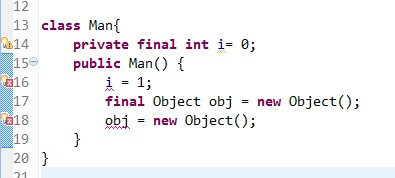

# final关键字

## 咋用
在Java中，final关键字可以用来修饰类、方法和变量（包括成员变量和局部变量）

* 1.修饰类
  当用final修饰一个类时，表明这个类不能被继承
  `final类中的成员变量可以根据需要设为final，但是要注意final类中的所有成员方法都会被隐式地指定为final方法`
 
* 2.修饰方法
   只有在想明确禁止 该方法在子类中被覆盖的情况下才将方法设置为final的
   类的private方法会隐式地被指定为final方法
   
   ```
   使用final方法的原因有两个。第一个原因是把方法锁定，以防任何继承类修改它的含义；第二个原因是效
   率。在早期的Java实现版本中，会将final方法转为内嵌调用。但是如果方法过于庞大，可能看不到内嵌调
   用带来的任何性能提升。在最近的Java版本中，不需要使用final方法进行这些优化了
   ```
* 3.修饰变量
  对于一个final变量，如果是基本数据类型的变量，则其数值一旦在初始化之后便不能更改；如果是引用类型
  的变量，则在对其初始化之后便不能再让其指向另一个对象
  
  
  
  
## 深入了解下?

**1.类的final变量和普通变量有什么区别？**

```java
public class Test {
    public static void main(String[] args)  {
        String a = "hello2"; 
        final String b = "hello";
        String d = "hello";
        String c = b + 2; 
        String e = d + 2;
        System.out.println((a == c));
        System.out.println((a == e));
    }
}
```
输出

```
true
false
```

当final变量是基本数据类型以及String类型时，如果在编译期间能知道它的确切值，则编译器会把它当做编译期常量使用。也就是说在用到该final变量的地方，相当于直接访问的这个常量，不需要在运行时确定.

因此在上面的一段代码中，由于变量b被final修饰，因此会被当做编译器常量，所以在使用到b的地方会直接将变量b 替换为它的  值。而对于变量d的访问却需要在运行时通过链接来进行。
Q: 所以e是重新new的 而c是引用常量池里的值??

**2.被final修饰的引用变量指向的对象内容可变吗？**

在上面提到被final修饰的引用变量一旦初始化赋值之后就不能再指向其他的对象，那么该引用变量指向的对象的内容可变吗？

```java
public class Test {
    public static void main(String[] args)  {
        final MyClass myClass = new MyClass();
        System.out.println(++myClass.i);
 
    }
}
 
class MyClass {
    public int i = 0;
}
```
输出
```
1
```
实际上final不变的是指向的内存地址不变,但是具体内存地址代表的内容可以改变.

**3.final和static**
static作用于成员变量用来表示只保存一份副本，而final的作用是用来保证变量不可变

```java
public class Test {
    public static void main(String[] args)  {
        MyClass myClass1 = new MyClass();
        MyClass myClass2 = new MyClass();
        System.out.println(myClass1.i);
        System.out.println(myClass1.j);
        System.out.println(myClass2.i);
        System.out.println(myClass2.j);
 
    }
}
 
class MyClass {
    public final double i = Math.random();
    public static double j = Math.random();
}
```
运行这段代码就会发现，每次打印的两个j值都是一样的，而i的值却是不同的

**4.匿名内部类中使用的外部局部变量为什么只能是final变量？**


**5.关于final参数的问题**
1.如果参数是普通数据类型,那么java参数传递采用的是值传递，对于基本类型的变量，相当于直接将变量进行了拷贝。所以即使没有final修饰的情况下，在方法内部改变了变量i的值也不会影响方法外的i

2.对于引用变量，传递的是引用的值，也就是说让实参和形参同时指向了同一个对象，因此让形参重新指向另一个对象对实参并没有任何影响

所以final修饰参数 并不能起到“防止你无意的修改而影响到调用方法外的变量”的作用.

**6.空final**

```java
   class Reapeat {
        private final int a = 10;
        private final int b;

        public Reapeat(int b) {
            this.b = b;
        }
    }
```
所谓的”空白final”是指被声明的为final但又未给定初值的对象引用或者基本数据。无论在什么情况下，编译器都会去确保final在使用前必须被初始化。若不进行初始化，会提示错误.

【参考】
<http://www.cnblogs.com/dolphin0520/p/3736238.html>

