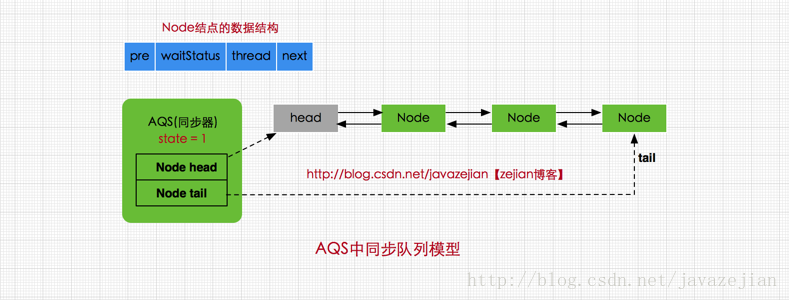
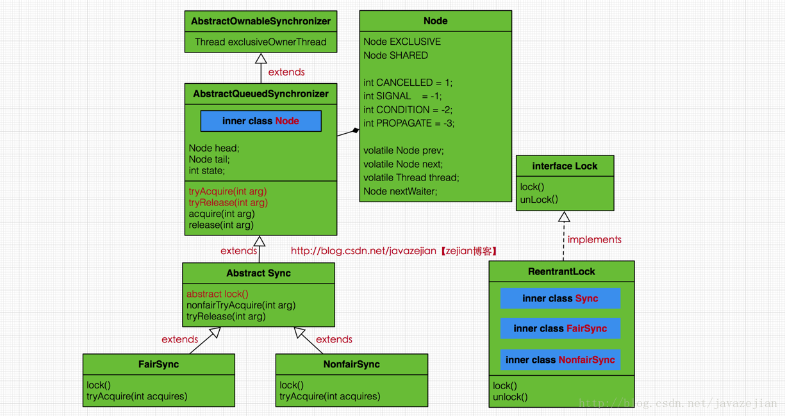
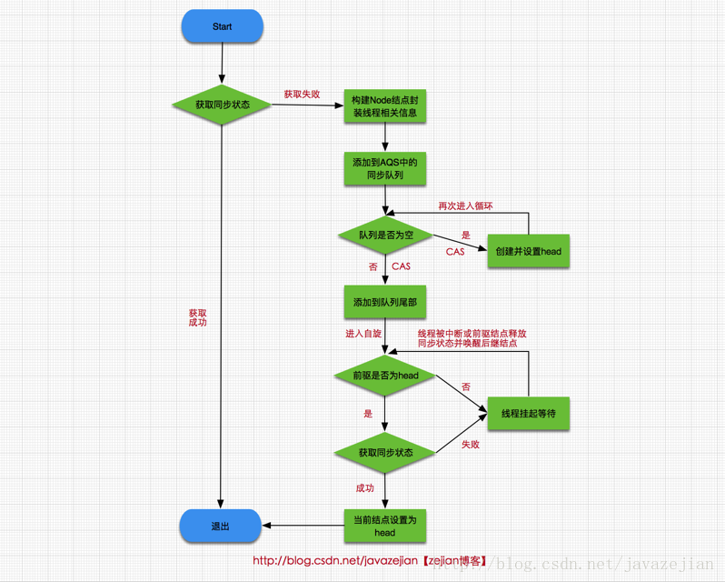

# 并发-Lock
## Lock接口

synchronized属于隐式锁，即锁的持有与释放都是隐式的
`那么synchronized是怎么释放的呢?`
Lock接口提供了lock()方法和unLock()方法对显式加锁和显式释放锁操作进行支持

```java
Lock lock = new ReentrantLock();
lock.lock();
try{
    //临界区......
}finally{
    lock.unlock();
}
```

**Lock对象锁与synchronized相比的新特性**

* 1.可中断锁的获取(synchronized在等待获取锁时是不可中的)，
* 2.超时中断锁的获取，
* 3.等待唤醒机制的多条件变量Condition

```java
public interface Lock {
    //加锁
    void lock();

    //解锁
    void unlock();

    //可中断获取锁，与lock()不同之处在于可响应中断操作，即在获
    //取锁的过程中可中断，注意synchronized在获取锁时是不可中断的
    void lockInterruptibly() throws InterruptedException;

    //尝试非阻塞获取锁，调用该方法后立即返回结果，如果能够获取则返回true，否则返回false
    boolean tryLock();

    //根据传入的时间段获取锁，在指定时间内没有获取锁则返回false，如果在指定时间内当前线程未被中并断获取到锁则返回true
    boolean tryLock(long time, TimeUnit unit) throws InterruptedException;

    //获取等待通知组件，该组件与当前锁绑定，当前线程只有获得了锁
    //才能调用该组件的wait()方法，而调用后，当前线程将释放锁。
    Condition newCondition();

}
```

## 重入锁ReetrantLock

**重入**
重入锁ReetrantLock,作用与synchronized关键字相当，但比synchronized更加灵活.
`synchronized也是重入锁`

**公平**
支持公平锁与非公平锁。所谓的公平与非公平指的是在请求先后顺序上，先对锁进行请求的就一定先获取到锁，那么这就是公平锁，反之，如果对于锁的获取并没有时间上的先后顺序，如后请求的线程可能先获取到锁，这就是非公平锁


## AQS
**什么是AQS 类名称的简称**
`AbstractQueuedSynchronizer又称为队列同步器(后面简称AQS)`

**AQS工作基本原理**


1.如何判断共享资源是否需要锁定
AQS通过一个int类型的成员变量state来控制同步状态,当state=0时，则说明没有任何线程占有共享资源的
锁,当state=1时，则说明有线程目前正在使用共享变量

2.等待和竞争队列
AQS通过**内部类Node**构成FIFO的同步队列来完成线程获取锁的排队工作.
通过利用**内部类ConditionObject**构建等待队列.
`当Condition调用wait()方法后，线程将会加入等待队列中，而当Condition调用signal()方法后，线程将从等待队列转移动同步队列中进行锁竞争`

3.同步队列模型

```java
/**
 * AQS抽象类
 */
public abstract class AbstractQueuedSynchronizer
    extends AbstractOwnableSynchronizer{
//指向同步队列队头
private transient volatile Node head;

//指向同步的队尾
private transient volatile Node tail;

//同步状态，0代表锁未被占用，1代表锁已被占用
private volatile int state;

//省略其他代码......
}

```


4.Node是什么?
`Node结点是对每一个访问同步代码的线程的封装,其包含了需要同步的线程本身以及线程的状态`

```java
static final class Node {
    //共享模式
    static final Node SHARED = new Node();
    //独占模式
    static final Node EXCLUSIVE = null;

    //标识线程已处于结束状态
    static final int CANCELLED =  1;
    //等待被唤醒状态
    static final int SIGNAL    = -1;
    //条件状态，
    static final int CONDITION = -2;
    //在共享模式中使用表示获得的同步状态会被传播
    static final int PROPAGATE = -3;

    //等待状态,存在CANCELLED、SIGNAL、CONDITION、PROPAGATE 4种
    volatile int waitStatus;

    //同步队列中前驱结点
    volatile Node prev;

    //同步队列中后继结点
    volatile Node next;

    //请求锁的线程
    volatile Thread thread;

    //等待队列中的后继结点，这个与Condition有关，稍后会分析
    Node nextWaiter;

    //判断是否为共享模式
    final boolean isShared() {
        return nextWaiter == SHARED;
    }

    //获取前驱结点......
}

```
SHARED和EXCLUSIVE常量分别代表共享模式和独占模式

```
所谓共享模式是一个锁允许多条线程同时操作，如信号量Semaphore采用的就是基于AQS的共享模式实现的，而独占模式则是同一个时间段只能有一个线程对共享资源进行操作，多余的请求线程需要排队等待，如ReentranLock。
```

变量waitStatus则表示当前被封装成Node结点的等待状态，共有4种取值CANCELLED、SIGNAL、CONDITION、PROPAGATE

```
CANCELLED：值为1，在同步队列中等待的线程等待超时或被中断，需要从同步队列中取消该Node的结点，其结点的waitStatus为CANCELLED，即结束状态，进入该状态后的结点将不会再变化。

SIGNAL：值为-1，被标识为该等待唤醒状态的后继结点，当其前继结点的线程释放了同步锁或被取消，将会通知该后继结点的线程执行。说白了，就是处于唤醒状态，只要前继结点释放锁，就会通知标识为SIGNAL状态的后继结点的线程执行。
是否可以理解 SIGNAL状态的Node都是具备竞争资格的线程?还是整个同步队列都是有竞争资格的?
前驱节点释放锁之后,如何裁定该是哪个后驱节点获得锁?

CONDITION：值为-2，与Condition相关，该标识的结点处于等待队列中，结点的线程等待在Condition上，当其他线程调用了Condition的signal()方法后，CONDITION状态的结点将从等待队列转移到同步队列中，等待获取同步锁。

PROPAGATE：值为-3，与共享模式相关，在共享模式中，该状态标识结点的线程处于可运行状态。

0状态：值为0，代表初始化状态。
```

ReentrantLock与AQS的关系


```
ReentrantLock内部存在3个实现类，分别是Sync、NonfairSync、FairSync
其中Sync继承自AQS实现了解锁tryRelease()方法，而NonfairSync(非公平锁)、 FairSync(公平锁)则
继承自Sync，实现了获取锁的tryAcquire()方法，ReentrantLock的所有方法调用都通过间接调用AQS和
Sync类及其子类来完成的
```

## ReetrantLock分析AQS独占模式实现过程
## ReetrantLock独占锁

1.获取锁时，首先对同步状态执行CAS操作，尝试把state的状态从0设置为1
2.更改state失败,则执行执行 acquire(1)方法

```
acquire(1)
一是尝试再次获取同步状态，如果获取成功则将当前线程设置为OwnerThread，否则失败，二是判断当前线程current是否为OwnerThread，如果是则属于重入锁，state自增1，并获取锁成功，
```

```java
public final void acquire(int arg) {
    //再次尝试获取同步状态
    if (!tryAcquire(arg) &&
        acquireQueued(addWaiter(Node.EXCLUSIVE), arg))
        selfInterrupt();
}
```
3.再次获取锁失败,线程就会被封装添加到同步队列内

```
如果一次加入队列失败,就会使用死循环重复操作,直到成功.
之所以会失败,是因为存在多个线程同时加入队列的情况,而加入队列又是使用CAS.CAS就会存在失败的情况
```

4.添加到同步队列后，head的next结点就会进入一个自旋过程，即观察时机待条件满足获取同步状态，然后从同步队列退出并结束自旋

5.自旋过程:判断自己的前驱是否时head,如果是且设置state成功,则将自身设置为head.
  反之清除同步队列中位于自身前面的state=取消CANCEL的Node节点**(这就是shouldParkAfterFailedAcquire)**,同时挂起自身**parkAndCheckInterrupt**.



**公平锁到底在哪里公平?**
非公平锁的nonfairTryAcquire(int acquires)方法去申请锁
公平锁tryAcquire(int acquires) 方法去申请锁

区别在于tryAcquire在设置state的时候,会判断同步队列是否存在结点，如果存在必须先执行完同步队列中结点的线程.而非公平锁呢，当线程请求到来时，不管同步队列是否存在线程结点，直接尝试获取同步状态，获取成功直接访问共享资源

换个视角,也就是说,当没有新的线程加入竞争,那么非公平锁也是按照同步队列里的顺序(也就是申请锁的顺序)一个个去执行.

锁的目的就是让线程一次执行一个.加入队列,也完成这个要求,每次只允许出队的线程去执行.
所谓的锁竞争的本质就是针对state的CAS

**synchronized和Lock**
synchronized JVM可能会将锁抛给操作系统,从而导致线程用户态切换到内核态.
Lock 只是构造了一个同步队列,来保证锁有序进行.其实所有线程没有锁的时候,都是执行了自旋.并没有释放.

关于Lock.lock
```
1.ReentrantLock.lock
2.sync.lock()
 非公平或者公平锁实现了lock()
3.NonfairSync.lock
  CAS设置state 成功setExclusiveOwnerThread 失败acquire()
4.acquire() 是AQS提供的方法 
  a 干了3事儿:尝试获取锁tryAcquire()/将线程加入同步队列acquireQueued()&自旋,获取锁/挂起
  b tryAcquire()是AQS的抽象方法,由Sync的子类NonfairSync负责具体实现
  C tryAcquire()就是在此CAS state
```

`加入队列 前边所有的取消都删除 其他都置为等待。第一个自旋。`
### 锁的释放

```java
//ReentrantLock类的unlock
public void unlock() {
    sync.release(1);
}

//AQS类的release()方法
public final boolean release(int arg) {
    //尝试释放锁
    if (tryRelease(arg)) {

        Node h = head;
        if (h != null && h.waitStatus != 0)
            //唤醒后继结点的线程
            unparkSuccessor(h);
        return true;
    }
    return false;
}

//ReentrantLock类中的内部类Sync实现的tryRelease(int releases) 
protected final boolean tryRelease(int releases) {

      int c = getState() - releases;
      if (Thread.currentThread() != getExclusiveOwnerThread())
          throw new IllegalMonitorStateException();
      boolean free = false;
      //判断状态是否为0，如果是则说明已释放同步状态
      if (c == 0) {
          free = true;
          //设置Owner为null
          setExclusiveOwnerThread(null);
      }
      //设置更新同步状态
      setState(c);
      return free;
  }
```

```
从代码执行操作来看，这里主要作用是用unpark()唤醒同步队列中最前边未放弃线程(也就是状态为CANCELLED的线程结点s)。此时，回忆前面分析进入自旋的函数acquireQueued()，s结点的线程被唤醒后，会进入acquireQueued()函数的if (p == head && tryAcquire(arg))的判断，如果p!=head也不会有影响，因为它会执行shouldParkAfterFailedAcquire()，由于s通过unparkSuccessor()操作后已是同步队列中最前边未放弃的线程结点，那么通过shouldParkAfterFailedAcquire()内部对结点状态的调整，s也必然会成为head的next结点，因此再次自旋时p==head就成立了，然后s把自己设置成head结点，表示自己已经获取到资源了，最终acquire()也返回了，这就是独占锁释放的过程。 
```

```
取消关键步骤:
1 设置state
2 唤醒同步队列内最前边的线程 
释放的本质就是将 AQS state设置为0
将node节点的状态设置
```

所以问题:
只有同步队列的第一个node才会自旋?其他的都会挂起.
unsafe 这个类 需要了解
`释放  唤醒第一个 让它自旋`
## 神奇的Condition

1.通过Condition能够精细的控制多线程的休眠与唤醒。

2.对于一个锁，我们可以为多个线程间建立不同的Condition,也就是一个锁可以有多个等待队列

ConditionObject

等待队列是放弃执行资格的线程
同步队列是参与竞争的线程.实际上也根本没有竞争.
### await
1.await 会调用release ,不会将node的waitState改成取消,会改成0
2.await 当前线程如果不在同步队列内,挂起.
3.await 如果在同步队列内,开始自旋努力获取到锁

### signal
1.从等待队列移除
2.加入同步队列,如果前驱节点已经是取消了,唤醒自己开始获取锁

**参考**
<https://blog.csdn.net/javazejian/article/details/75043422>
<https://blog.csdn.net/SumResort_LChaowei/article/details/72857921>

```
笔记不是单纯重复 复制黏贴,而是理解消化.变成自己的体系.
以下有几个问题:
1.就什么线程不安全?
本质是多个线程对同一内存区域进行了操作,这个操作并不是原子的(参考32位系统的long的加减/JMM 工作内
存和主内容/) 或者线程间并不是有序的.从而某些线程操作的内容有异(明明应该是对10+1,却变成了对
11+1),导致了程序运算结果和预期不符.

2.怎么解决不安全?
操作是有序的,一个一个的来(volatile保证可见性还是会有问题,你看到的时候是10 等你操作的时候可能已
经是11了).
想要有序,就涉及到锁.Lock或者synchronized.
涉及到锁,就涉及性能问题,并发是就是为了提高效率而生,而锁又给这种高效添加了限制.所以各种锁优化(偏向锁/轻量锁/锁自旋/锁粗化/CAS)
```

