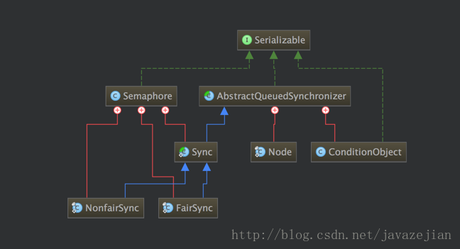
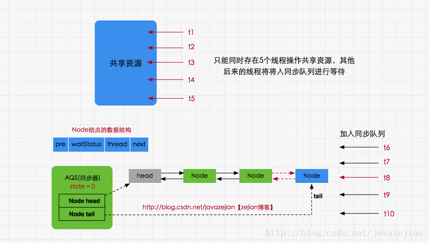

# 并发-Semaphore

信号量(Semaphore)，又被称为信号灯，在多线程环境下用于协调各个线程, 以保证它们能够正确、合理的使用公共资源.


### Semaphore共享锁的使用

```
信号量维护了一个许可集，我们在初始化Semaphore时需要为这个许可集传入一个数量值，该数量值代表同一
时间能访问共享资源的线程数量。线程可以通过acquire()方法获取到一个许可，然后对共享资源进行操作，
注意如果许可集已分配完了，那么线程将进入等待状态，直到其他线程释放许可才有机会再获取许可，线程释放
一个许可通过release()方法完成
```

```java
public class SemaphoreTest {

    public static void main(String[] args) {  
       // 线程池 
       ExecutorService exec = Executors.newCachedThreadPool();  
       //设置信号量同时执行的线程数是5 
       final Semaphore semp = new Semaphore(5);  
       // 模拟20个客户端访问 
       for (int index = 0; index < 20; index++) {
           final int NO = index;  
           Runnable run = new Runnable() {  
               public void run() {  
                   try {  
                       //使用acquire()获取锁 
                       semp.acquire();  
                       System.out.println("Accessing: " + NO);  
                       //睡眠1秒
                       Thread.sleep(1000);  

                   } catch (InterruptedException e) {  
                   }  finally {
                        //使用完成释放锁 
                        semp.release();
                    }
               }  
           };  
           exec.execute(run);  
       }  
       // 退出线程池 
       exec.shutdown();  
   }  
}
```

### Semaphore实现互斥锁

在初始化信号量时传入1，使得它在使用时最多只有一个可用的许可，从而可用作一个相互排斥的锁.

```java
public class SemaphoreMutex {
    //初始化为1,互斥信号量
    private final static Semaphore mutex = new Semaphore(1);

    public static void main(String[] args){
        ExecutorService pools = Executors.newCachedThreadPool();

        for (int i=0 ; i < 10;i++){
            final int index = i;
           Runnable run = new Runnable() {
               @Override
               public void run() {
                   try {
                       mutex.acquire();
                       System.out.println(String.format("[Thread-%s]任务id --- %s",Thread.currentThread().getId(),index));
                       TimeUnit.SECONDS.sleep(1);

                   } catch (InterruptedException e) {
                       e.printStackTrace();
                   } finally {
                        //使用完成释放锁 
                       mutex.release();
                       System.out.println("-----------release");
                    }
               }
           };
            pools.execute(run);
        }
        pools.shutdown();
    }
}
```

### Semaphore的内部实现

类图结构


Semaphore内部同样存在继承自AQS的内部类Sync以及继承自Sync的公平锁(FairSync)和非公平锁(NofairSync),从这点也足以说明Semaphore的内部实现原理也是基于AQS并发组件的.

Semaphore的内部类公平锁(FairSync)和非公平锁(NoFairSync)各自实现不同的获取锁方法即tryAcquireShared(int arg)，毕竟公平锁和非公平锁的获取稍后不同，而释放锁tryReleaseShared(int arg)的操作交由Sync实现，因为释放操作都是相同的，因此放在父类Sync中实现当然是最好的

**源码阅读**

1.通过默认构造函数创建时，诞生的就是非公平锁

```java
//默认创建公平锁，permits指定同一时间访问共享资源的线程数
public Semaphore(int permits) {
        sync = new NonfairSync(permits);
    }

public Semaphore(int permits, boolean fair) {
     sync = fair ? new FairSync(permits) : new NonfairSync(permits);
 }
```

2.传入的许可数permits传递给了父类，最终会传给AQS中的state变量，也就是同步状态的变量
`所以AQS的state不仅仅是有1和0.所以Lock几次就要state加几次`

```java
//AQS中控制同步状态的state变量
public abstract class AbstractQueuedSynchronizer
    extends AbstractOwnableSynchronizer {

    private volatile int state;

    protected final int getState() {
        return state;
    }

    protected final void setState(int newState) {
        state = newState;
    }

    //对state变量进行CAS 操作
    protected final boolean compareAndSetState(int expect, int update) {
        return unsafe.compareAndSwapInt(this, stateOffset, expect, update);
    }

}
```
Semaphore的初始化值也就是state的初始化值。当我们调用Semaphore的acquire()方法后，执行过程是这样的，当一个线程请求到来时，如果state值代表的许可数足够使用，那么请求线程将会获得同步状态即对共享资源的访问权，并更新state的值(一般是对state值减1)，但如果state值代表的许可数已为0，则请求线程将无法获取同步状态，线程将被加入到同步队列并阻塞，直到其他线程释放同步状态(一般是对state值加1)才可能获取对共享资源的访问权

4.**acquire()**究竟干了什么呢?
首先**tryAcquireShared(arg)**死循环判断设置state并且判断state是否<0.如果<0调用**doAcquireSharedInterruptibly(arg)**加入等待队列

```java
//Semaphore中非公平锁NonfairSync的tryAcquireShared()
protected int tryAcquireShared(int acquires) {
    //调用了父类Sync中的实现方法
    return nonfairTryAcquireShared(acquires);
}

//Syn类中
abstract static class Sync extends AbstractQueuedSynchronizer {

    final int nonfairTryAcquireShared(int acquires) {
         //使用死循环
         for (;;) {
             int available = getState();
             int remaining = available - acquires;
             //判断信号量是否已小于0或者CAS执行是否成功
             if (remaining < 0 ||
                 compareAndSetState(available, remaining))
                 return remaining;
         }
     }
}
```

```java
private void doAcquireSharedInterruptibly(int arg)
        throws InterruptedException {
     //创建共享模式的结点Node.SHARED，并加入同步队列
   final Node node = addWaiter(Node.SHARED);
     boolean failed = true;
     try {
         //进入自旋操作
         for (;;) {
             final Node p = node.predecessor();
             //判断前驱结点是否为head
             if (p == head) {
                 //尝试获取同步状态
                 int r = tryAcquireShared(arg);
                 //如果r>0 说明获取同步状态成功
                 if (r >= 0) {
                     //将当前线程结点设置为头结点并传播               
                     setHeadAndPropagate(node, r);
                     p.next = null; // help GC
                     failed = false;
                     return;
                 }
             }
           //调整同步队列中node结点的状态并判断是否应该被挂起
           //并判断是否需要被中断，如果中断直接抛出异常，当前结点请求也就结束
             if (shouldParkAfterFailedAcquire(p, node) &&
                 parkAndCheckInterrupt())
                 throw new InterruptedException();
         }
     } finally {
         if (failed)
             //结束该结点线程的请求
             cancelAcquire(node);
     }
    }

```
由于当前线程没有获取同步状态，因此创建一个共享模式（Node.SHARED）的结点并通过addWaiter(Node.SHARED)加入同步队列，加入完成后，当前线程进入自旋状态，首先判断前驱结点是否为head，如果是，那么尝试获取同步状态并返回r值，如果r大于0，则说明获取同步状态成功，将当前线程设置为head并传播，**传播指的是，同步状态剩余的许可数值不为0，通知后续结点继续获取同步状态，到此方法将会return结束，获取到同步状态的线程将会执行原定的任务*

共享锁简单模型如下



5.release()干了什么呢?通过**tryReleaseShared(arg)**方法尝试释放同步状态，如果释放成功，那么将调用**doReleaseShared()**唤醒同步队列中后继结点的线程

tryReleaseShared 就是对AQS进行了自增
```java
//在Semaphore的内部类Sync中实现的
protected final boolean tryReleaseShared(int releases) {
       for (;;) {
              //获取当前state
             int current = getState();
             //释放状态state增加releases
             int next = current + releases;
             if (next < current) // overflow
                 throw new Error("Maximum permit count exceeded");
              //通过CAS更新state的值
             if (compareAndSetState(current, next))
                 return true;
         }
        }
```
**参考**

<https://blog.csdn.net/javazejian/article/details/76167357>


