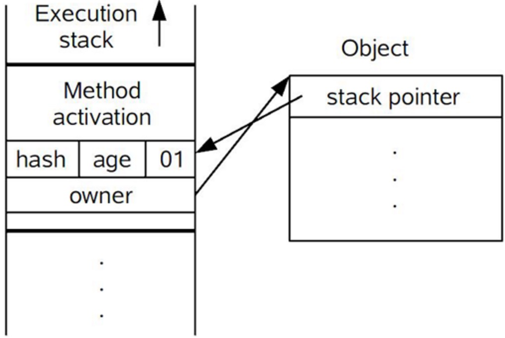

# 并发-synchronized

`Q1:synchronized 不同级别的锁的基本实现逻辑`

`Q2:不同级别的锁 应对的场景`

`Q3:锁膨胀的过程`

## 为什么会出现并发问题
造成线程安全问题的主要诱因有两点:

* 一是存在共享数据(也称临界资源)
* 二是存在多条线程共同操作共享数据

## 三种应用方式

* 1.修饰实例方法，作用于当前实例加锁，进入同步代码前要获得当前实例对象的锁

* 2.修饰静态方法，作用于当前类对象加锁，进入同步代码前要获得当前类对象的锁

* 3.修饰代码块，指定加锁对象，对给定对象加锁，进入同步代码库前要获得给定对象的锁

## 锁

### 对象头

**对象头的结构**

`synchronized使用的锁对象是存储在Java对象头里的，jvm中采用2个字来存储对象头(如果对象是数组则会分配3个字，多出来的1个字记录的是数组长度)，其主要结构是由Mark Word 和 Class Metadata Address 组成`

| 虚拟机位数  | 头对象结构 |说明|
| --- | --- | --- |
| 32/64bit | Mark Word |存储对象的hashCode、锁信息或分代年龄或GC标志等信息|
| 32/64bit | Class Metadata Address |类型指针指向对象的类元数据，JVM通过这个指针确定该对象是哪个类的实例|

**Mark Word的结构**

`Mark Word在默认情况下存储着对象的HashCode、分代年龄、锁标记位等以下是32位JVM的Mark Word默认存储结构`

| 锁状态	 | 25bit	 |4bit|1bit是否是偏向锁|2bit 锁标志位|
| --- | --- | --- |--- |--- |
| 无锁状态 | 对象HashCode |对象分代年龄|0|01|

Mark Word 被设计成为一个非固定的数据结构，以便存储更多有效的数据，它会根据对象本身的状态复用自己的存储空间，如32位JVM下，除了上述列出的Mark Word默认存储结构外，还有如下可能变化的结构:


### 轻量锁

轻量级锁并不是用来代替重量级锁的，它的本意是在没有多线程竞争的前提下，减少传统的重量级锁使用产生的性能消耗。

轻量级锁所适应的场景是线程交替执行同步块的情况，如果存在同一时间访问同一锁的情况，就会导致轻量级锁膨胀为重量级锁.

**加锁**

```
轻量锁没有使用monitor对象,而是使用了栈帧对 锁对象的Mark word进行了拷贝( 这个位于线程空间中的拷
贝的Mark word被称为 Displaced Mark Word),同时锁对象的Mark word的锁记录空间会指向线程空间中
的 Displaced Mark Word.
```

轻量锁的头Mark word 和 栈空间


**解锁**

```
（1）通过CAS操作尝试把线程中复制的Displaced Mark Word对象替换当前的Mark Word。

（2）如果替换成功，整个同步过程就完成了。

（3）如果替换失败，说明有其他线程尝试过获取该锁（此时锁已膨胀），那就要在释放锁的同时，唤醒被挂起的线程。
　　
解锁其实就是将栈空间中的Displaced Mark Word,尝试还回去.
还成功了,整个同步过程结束
还失败了,就说明锁膨胀了,Mark Word中锁的标示为已经改为重锁
```

Q:对象和 monitor 的关系

Q:锁膨胀的过程

Q:不同类型的锁,对象头的数据结构是什么样的?

Q:所谓的对象头是 谁的对象头?是monitor的头还是包含竞争资源的对象的头?

### 偏向锁

轻量级锁是为了在线程交替执行同步块时提高性能，而偏向锁则是在只有一个线程执行同步块时进一步提高性能

**偏向锁获取过程**

```
（1）访问Mark Word中偏向锁的标识是否设置成1，锁标志位是否为01——确认为可偏向状态。

（2）如果为可偏向状态，则测试线程ID是否指向当前线程，如果是，进入步骤（5），否则进入步骤（3）。

（3）如果线程ID并未指向当前线程，则通过CAS操作竞争锁。如果竞争成功，则将Mark Word中线程ID设置为当前线程ID，然后执行（5）；如果竞争失败，执行（4）。

（4）如果CAS获取偏向锁失败，则表示有竞争。当到达全局安全点（safepoint）时获得偏向锁的线程被挂起，偏向锁升级为轻量级锁，然后被阻塞在安全点的线程继续往下执行同步代码。

（5）执行同步代码。
```

**解锁**

```
偏向锁的撤销在上述第四步骤中有提到。偏向锁只有遇到其他线程尝试竞争偏向锁时，持有偏向锁的线程才会释
放锁，线程不会主动去释放偏向锁。偏向锁的撤销，需要等待全局安全点（在这个时间点上没有字节码正在执
行），它会首先暂停拥有偏向锁的线程，判断锁对象是否处于被锁定状态，撤销偏向锁后恢复到未锁定（标志位
为“01”）或轻量级锁（标志位为“00”）的状态
```

三锁之间的转换


### 重锁

重量级锁也就是通常说synchronized的对象锁，锁标识位为10，其中Mark Word指针指向的是monitor对象.

monitor的结构

```c
ObjectMonitor() {
    _header       = NULL;
    _count        = 0; //记录个数
    _waiters      = 0,
    _recursions   = 0;
    _object       = NULL;
    _owner        = NULL;
    _WaitSet      = NULL; //处于wait状态的线程，会被加入到_WaitSet
    _WaitSetLock  = 0 ;
    _Responsible  = NULL ;
    _succ         = NULL ;
    _cxq          = NULL ;
    FreeNext      = NULL ;
    _EntryList    = NULL ; //处于等待锁block状态的线程，会被加入到该列表
    _SpinFreq     = 0 ;
    _SpinClock    = 0 ;
    OwnerIsThread = 0 ;
  }
```

ObjectMonitor中有两个队列，_WaitSet 和 _EntryList，用来保存ObjectWaiter对象列表( 每个等待锁的线程都会被封装成ObjectWaiter对象)，_owner指向持有ObjectMonitor对象的线程，当多个线程同时访问一段同步代码时，首先会进入 _EntryList 集合，当线程获取到对象的monitor 后进入 _Owner 区域并把monitor中的owner变量设置为当前线程同时monitor中的计数器count加1，若线程调用 wait() 方法，将释放当前持有的monitor，owner变量恢复为null，count自减1，同时该线程进入 WaitSe t集合中等待被唤醒


## QA和总结


一个线程所操作的资源是什么锁,要看锁对象的头信息.头信息里有标示为表示该锁是偏向锁还是轻量锁或者重量级锁
synchronized的对象除非指定,不然就是:

|应用方式|锁对象|
|---|---|
|同步事例方法 |实例对象|
|同步静态方法 |Class对象|
|同步代码块|   自定义对象|

实际上无论哪种级别的锁,实现独占的重要标志是**在Mark word(头对象数据结构的一部分)内标记了持有锁的线程.**

`重锁是Mark word 的monitor对象的_owner属性 这是C++实现的`

`轻量锁是在Mark word 内指向了线程锁记录（Lock Record）的空间,这个空间里存储了锁对象原先的Mark word`

`偏向锁是在Mark word 内存存储了线程ID`


**Q1:synchronized 不同级别的锁的基本实现逻辑**

**重锁**

同步代码块 通过monitorenter指令和monitorexit指令 实现锁的添加释放
同步方法 通过ACC_SYNCHRONIZED标识

**轻量锁**

轻量锁先拷贝(将锁对象的Mark word拷贝到线程内的锁空间中)
在两次CAS替换(锁对象Mark word指向线程的锁空间,线程锁空间的owner指向锁对象)

**偏向锁**

CAS 设置线程ID.如果失败,膨胀为清凉锁,持有锁的线程到达安全点后释放锁.

**Q2:不同级别的锁 应对的场景**
轻量级锁并不是用来代替重量级锁的，它的本意是在没有多线程竞争的前提下，减少传统的重量级锁使用产生的性能消耗.
有竞争,但是大家交叉进行.持有锁的时间很短,不挨着.

偏向锁,引入偏向锁是为了在无多线程竞争的情况下尽量减少不必要的轻量级锁执行路径.
根本没啥竞争,就一个线程在玩儿

**Q3:锁膨胀的过程**

1.设置线程ID,失败,膨胀成轻量锁.到达安全点后,大家公平竞争
2.CAS线程和锁对象相互标记,标记失败,膨胀重锁,之前获得锁的线程执行完毕后,大家公平竞争

**参考**
<https://blog.csdn.net/javazejian/article/details/72828483>

<https://www.cnblogs.com/paddix/p/5405678.html>


