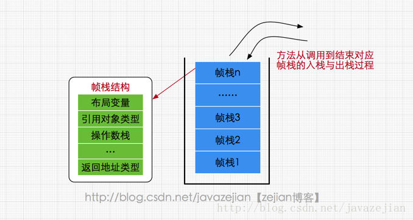
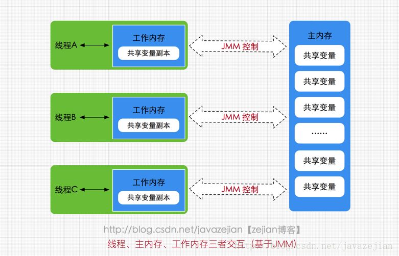

线程安全
## JVM内存区域
* **方法区（Method Area）**
线程共享区域。主要用于存储已被虚拟机加载的类信息、常量、静态变量、即时编译器编译后的代码等数据。
存放运行时常量池(Runtime Constant Pool）的区域。

* **JVM堆（Java Heap）**
线程共享区域。主要用于存放对象实例。GC区域。

* **程序计数器(Program Counter Register)**
线程私有区域。是一小块内存空间，主要代表当前线程所执行的字节码行号指示器。

* **虚拟机栈(Java Virtual Machine Stacks)**
线程私有区域。与线程同时创建。每个方法执行时都会创建一个栈桢来存储方法的的变量表、操作数栈、动态链接方法、返回值、返回地址等信息。


* **本地方法栈(Native Method Stacks)**
线程私有区域。

## JMM 内存模型描述

1.由于JVM运行程序的实体是线程，而每个线程创建时JVM都会为其创建一个工作内存(有些地方称为栈空间)，用于存储线程私有的数据，
2.而Java内存模型中规定所有变量都存储在主内存，主内存是共享内存区域，所有线程都可以访问，
3.线程对变量的操作(读取赋值等)必须在工作内存中进行，

```
首先要将变量从主内存拷贝的自己的工作内存空间，然后对变量进行操作，操作完成后再将变量写回主内存，不
能直接操作主内存中的变量，工作内存中存储着主内存中的变量副本拷贝，前面说过，工作内存是每个线程的私
有数据区域，因此不同的线程间无法访问对方的工作内存
```
4.线程间的通信(传值)必须通过主内存来完成，其简要访问过程如下图



JMM是围绕原子性，有序性、可见性一组规则。

```
JMM与Java内存区域唯一相似点，都存在共享数据区域和私有数据区域，在JMM中主内存属于共享数据区域，从
某个程度上讲应该包括了堆和方法区，而工作内存数据线程私有数据区域，从某个程度上讲则应该包括程序计数
器、虚拟机栈以及本地方法栈
```

## JMM中的主内存和工作内存说明

**主内存**

```
主要存储的是Java实例对象，所有线程创建的实例对象都存放在主内存中，不管该实例对象是成员变量还是方
法中的本地变量(也称局部变量)，当然也包括了共享的类信息、常量、静态变量。由于是共享数据区域，多条线
程对同一个变量进行访问可能会发现线程安全问题
```

**工作内存**

```
主要存储当前方法的所有本地变量信息(工作内存中存储着主内存中的变量副本拷贝)，每个线程只能访问自己的
工作内存，即线程中的本地变量对其它线程是不可见的
```
**主内存与工作内存的数据存储类型**

```
对于一个实例对象中的成员方法而言，如果方法中包含本地变量是基本数据类型
（boolean,byte,short,char,int,long,float,double），将直接存储在工作内存的帧栈结构中，但倘
若本地变量是引用类型，那么该变量的引用会存储在功能内存的帧栈中，而对象实例将存储在主内存(共享数据
区域，堆)中。但对于实例对象的成员变量，不管它是基本数据类型或者包装类型(Integer、Double等)还是
引用类型，都会被存储到堆区。至于static变量以及类本身相关信息将会存储在主内存中
```
## 硬件和Java
#### CPU 寄存器 缓存 内存

```
CPU需要访问主存时，会先读取一部分主存数据到CPU缓存(当然如果CPU缓存中存在需要的数据就会直接从缓存
获取)，进而在读取CPU缓存到寄存器，当CPU需要写数据到主存时，同样会先刷新寄存器中的数据到CPU缓存，
然后再把数据刷新到主内存中
```

#### Java线程与硬件

**一对一模型**

```
一对一模型，实际上就是通过语言级别层面程序去间接调用系统内核的线程模型，即我们在使用Java线程时，
Java虚拟机内部是转而调用当前操作系统的内核线程来完成当前任务
```

**内核线程**
> 简单来说 一对一就是：1个java线程对应1个内核线程

```
内核线程(Kernel-Level Thread，KLT)，它是由操作系统内核(Kernel)支持的线程，这种线程是由操作系
统内核来完成线程切换，内核通过操作调度器进而对线程执行调度，并将线程的任务映射到各个处理器上。每个
内核线程可以视为内核的一个分身,这也就是操作系统可以同时处理多任务的原因。由于我们编写的多线程程序
属于语言层面的，程序一般不会直接去调用内核线程，取而代之的是一种轻量级的进程(Light Weight
Process)，也是通常意义上的线程，由于每个轻量级进程都会映射到一个内核线程，因此我们可以通过轻量级
进程调用内核线程，进而由操作系统内核将任务映射到各个处理器，这种轻量级进程与内核线程间1对1的关系就
称为一对一的线程模型
```


#### JMM和内存硬件的关系
> 简单来说，P关系没有


#### JMM的存在必要性

```
A线程对X的值进行了修改，那么B线程能读取到这个修改么？不一定，因为取决于A是否将A的值写入了主内存。
这就是线程安全问题。Q：那么锁是强制刷新内存么？就是强制等待A的所有动作执行完毕后再允许B执行，那么就能保证A的修改都同步到了主内存中了。

```
JVM定义了一组规则，通过这组规则来决定一个线程对共享变量的写入何时对另一个线程可见，这组规则也称为Java内存模型（即JMM），JMM是围绕着程序执行的原子性、有序性、可见性展开的

**原子性**

* 1.32位的操作系统，对long和double读取不是原子性，因为一次只能读取32位
* 2.Q：那么juc中的原子类是？
* 3.指令重排。为了提高性能，编译器和处理器的常常会对指令做重排。
  `指令重排 单线程是不会出现问题，而在多线程的情况下，可能会有问题。`
  `代码编写的顺序与 编译后的顺序（编译器重排） 执行的顺序（指令重排） 这三者可能都不一样`
  这可是真tm的幻灭啊

**可见性**

>可见性指的是当一个线程修改了某个共享变量的值，其他线程是否能够马上得知这个修改的值

* 对于串行程序来说，可见性是不存在的，因为我们在任何一个操作中修改了某个变量的值，后续的操作中都能读取这个变量值，并且是修改过的新值

*


**参考**

<https://blog.csdn.net/blueheart20/article/details/52117761/>

