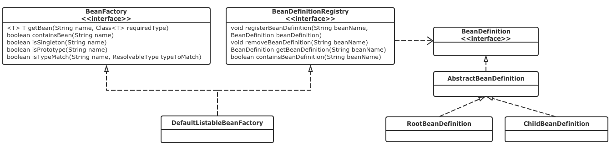

SpringBoot-自动加载的秘密
## IOC容器
#### Bean的new
**BeanDefinition**

```
容器中的每一个bean都会有一个对应的BeanDefinition实例，该实例负责保存bean对象的所有必要信息，包
括bean对象的class类型、是否是抽象类、构造方法和参数、其它属性等等
```

**BeanDefinitionRegistry**

```
BeanDefinitionRegistry抽象出bean的注册逻辑
```

**BeanFactory**

```
BeanFactory则抽象出了bean的管理逻辑，而各个BeanFactory的实现类就具体承担了bean的注册以及管理工作
```

**三者的关系：**


**Spring IoC容器的整个工作流程**

* 1.初始化阶段。加载xml构造成BeanDefinition，然后注册到BeanDefinitionRegistry
* 2.实例化阶段。用户使用bean的时候，使用BeanFactory.getBean()。就对bean实例化，并为其注入依赖。实际上我们一般都使用了ApplicationContext来代替BeanFactory。

#### Bean的改动
IoC容器负责管理容器中所有bean的生命周期，而在bean生命周期的不同阶段，Spring提供了不同的扩展点来改变bean的命运。在容器的启动阶段。

**BeanFactoryPostProcessor**

```
允许我们在容器实例化相应对象之前，对注册到容器的BeanDefinition所保存的信息做一些额外的操作，比
如修改bean定义的某些属性或者增加其他信息

例如PropertyPlaceholderConfigurer作为BeanFactoryPostProcessor被应用时，它会使用
properties配置文件中的值来替换相应的BeanDefinition中占位符所表示的属性值
```

**BeanPostProcessor**

```
跟BeanFactoryPostProcessor类似，它会处理容器内所有符合条件并且已经实例化后的对象。简单的对
比，BeanFactoryPostProcessor处理bean的定义，而BeanPostProcessor则处理bean完成实例化后的
对象
```


BeanPostProcessor中的postProcessBeforeInitialization()方法与postProcessAfterInitialization()分别对应图中前置处理和后置处理两个步骤将执行的方法

```
再来看一个更常见的例子，在Spring中经常能够看到各种各样的Aware接口，其作用就是在对象实例化完成以
后将Aware接口定义中规定的依赖注入到当前实例中。比如最常见的ApplicationContextAware接口，实现
了这个接口的类都可以获取到一个ApplicationContext对象。当容器中每个对象的实例化过程走到
BeanPostProcessor前置处理这一步时，容器会检测到之前注册到容器的
ApplicationContextAwareProcessor，然后就会调用其postProcessBeforeInitialization()方
法，检查并设置Aware相关依赖
```

## JavaConfig与常见Annotation
#### JavaConfig的前世今生
因为Spring项目的所有业务类均以bean的形式配置在XML文件中，造成了大量的XML文件，使项目变得复杂且难以管理。
JavaConfig子项目，它基于Java代码和Annotation注解来描述bean之间的依赖绑定关系。


XML配置方式来描述bean的定义：

```
<bean id="bookService" class="cn.moondev.service.BookServiceImpl"></bean>
```

而基于JavaConfig的配置形式是这样的：**SpringBoot 就是这么玩儿的**

```
@Configuration
public class MoonBookConfiguration {

    // 任何标志了@Bean的方法，其返回值将作为一个bean注册到Spring的IOC容器中
    // 方法名默认成为该bean定义的id
    @Bean
    public BookService bookService() {
        return new BookServiceImpl();
    }
}
```
两个bean之间有依赖关系的话，JavaConfig是这样的：

```
@Configuration
public class MoonBookConfiguration {

    // 如果一个bean依赖另一个bean，则直接调用对应JavaConfig类中依赖bean的创建方法即可
    // 这里直接调用dependencyService()
    @Bean
    public BookService bookService() {
        return new BookServiceImpl(dependencyService());
    }

    @Bean
    public OtherService otherService() {
        return new OtherServiceImpl(dependencyService());
    }

    @Bean
    public DependencyService dependencyService() {
        return new DependencyServiceImpl();
    }
}
```
#### 常见的注解

**@ComponentScan**
@ComponentScan注解对应XML配置形式中的<context:component-scan>元素，表示启用组件扫描，Spring会自动扫描所有通过注解配置的bean，然后将其注册到IOC容器中。我们可以通过basePackages等属性来指定@ComponentScan自动扫描的范围，如果不指定，默认从声明@ComponentScan所在类的package进行扫描。正因为如此，SpringBoot的启动类都默认在src/main/java下

`实际上，Springboot项目一般使用@SpringBootApplication 其中就包含了@ComponentScan`

**@Import**
@Import注解用于导入配置类，举个简单的例子：

```
@Configuration
public class MoonBookConfiguration {
    @Bean
    public BookService bookService() {
        return new BookServiceImpl();
    }
}
```
现在有另外一个配置类，比如：MoonUserConfiguration，这个配置类中有一个bean依赖于MoonBookConfiguration中的bookService，如何将这两个bean组合在一起？借助@Import即可：

```
@Configuration
// 可以同时导入多个配置类，比如：@Import({A.class,B.class})
@Import(MoonBookConfiguration.class)
public class MoonUserConfiguration {
    @Bean
    public UserService userService(BookService bookService) {
        return new BookServiceImpl(bookService);
    }
}
```

**@Conditional**

@Conditional注解表示在满足某种条件后才初始化一个bean或者启用某些配置。它一般用在由@Component、@Service、@Configuration等注解标识的类上面，或者由@Bean标记的方法上。如果一个@Configuration类标记了@Conditional，则该类中所有标识了@Bean的方法和@Import注解导入的相关类将遵从这些条件

我们可以通过实现Condition接口的matches()自定义这些Conditional.

<http://forlan.iteye.com/blog/2422298>

**@ConfigurationProperties与@EnableConfigurationProperties**
当某些属性的值需要配置的时候，我们一般会在application.properties文件中新建配置项，然后在bean中使用@Value注解来获取配置的值。假如我们很多地方用这个属性，但是我们要改属性名称呢？
对于更为复杂的配置，Spring Boot提供了更优雅的实现方式，那就是@ConfigurationProperties注解。
`@ConfigurationProperties 是将指定的注解文件或者前缀内的属性注入到对应bean中`

```
@Component
//  还可以通过@PropertySource("classpath:jdbc.properties")来指定配置文件
@ConfigurationProperties("jdbc.mysql")
// 前缀=jdbc.mysql，会在配置文件中寻找jdbc.mysql.*的配置项
pulic class JdbcConfig {
    public String url;
    public String username;
    public String password;
}

@Configuration
public class HikariDataSourceConfiguration {

    @AutoWired
    public JdbcConfig config;
    
    @Bean
    public HikariDataSource dataSource() {
        HikariConfig hikariConfig = new HikariConfig();
        hikariConfig.setJdbcUrl(config.url);
        hikariConfig.setUsername(config.username);
        hikariConfig.setPassword(config.password);
        // 省略部分代码
        return new HikariDataSource(hikariConfig);
    }
}
```

`@EnableConfigurationProperties注解表示对@ConfigurationProperties的内嵌支持，默认会将对应Properties Class作为bean注入的IOC容器中，即在相应的Properties类上不用加@Component注解`


## 配置文件的加载：SpringFactoriesLoader

1.Spring利用jvm提供的类加载器，获取所有路径下的jar内的配置文件

2.获取所有被@Configuration 标注的类，实例化后set对应的属性


**JVM的类加载器**
JVM提供了3种类加载器：BootstrapClassLoader、ExtClassLoader、AppClassLoader分别加载Java核心类库、扩展类库以及应用的类路径(CLASSPATH)下的类库。JVM通过双亲委派模型进行类的加载，我们也可以通过继承java.lang.classloader实现自己的类加载器

类加载器除了可以加载类，还可以加载配置文件`ClassLoader.getResources(String name)`

**双亲委托加载的盲点**
Java 提供了很多服务提供者接口(Service Provider Interface，SPI)，允许第三方为这些接口提供实现。 SPI 的接口是 Java 核心库的一部分，是由BootstrapClassLoader加载的；SPI实现的Java类一般是由AppClassLoader来加载的。BootstrapClassLoader是无法找到 SPI 的实现类的，因为它只加载Java的核心库。

线程上下文类加载器(ContextClassLoader)正好解决了这个问题。从名称上看，可能会误解为它是一种新的类加载器，实际上，它仅仅是Thread类的一个变量而已，可以通过setContextClassLoader(ClassLoader cl)和getContextClassLoader()来设置和获取该对象。如果不做任何的设置，Java应用的线程的上下文类加载器默认就是AppClassLoader。在核心类库使用SPI接口时，传递的类加载器使用线程上下文类加载器，就可以成功的加载到SPI实现的类。线程上下文类加载器在很多SPI的实现中都会用到

## Spring容器的事件监听机制
Java供了实现事件监听机制的两个基础类：自定义事件类型扩展自java.util.EventObject、事件的监听器扩展自java.util.EventListener.
`Java 只是提供了两个接口,其本身并没有提供监听器的注册/移除等管理`

SpringApplicationListener作为事件监听器接口定义，它继承自EventListener。ApplicationContext容器在启动时，会自动识别并加载EventListener类型的bean，一旦容器内有事件发布，将通知这些注册到容器的EventListener

## 揭秘自动配置

```java
@SpringBootApplication
public class MoonApplication {

    public static void main(String[] args) {
        SpringApplication.run(MoonApplication.class, args);
    }
}
```

* 1.@SpringBootApplication开启组件扫描和自动配置
* 2.SpringApplication.run则负责启动引导应用程序

**@SpringBootApplication**
`@SpringBootApplication是一个复合Annotation，它将三个有用的注解组合在一起`

**注解三剑客:**

* @SpringBootConfiguration就是@Configuration，它是Spring框架的注解，标明该类是一个JavaConfig配置类。
* @ComponentScan启用组件扫描
* @EnableAutoConfiguration注解表示开启Spring Boot自动配置功能
`Spring Boot会根据应用的依赖、自定义的bean、classpath下有没有某个类 等等因素来猜测你需要的
bean，然后注册到IOC容器中`

**@EnableAutoConfiguration的未卜先知**
`SpringBoot 是如何实现自动配置?`
@EnableAutoConfiguration中导入了EnableAutoConfigurationImportSelector类，而这个类的selectImports()通过SpringFactoriesLoader得到了大量的配置类，而每一个配置类则根据条件化配置来做出决策，以实现自动配置

```
1.先将常用的配置类加载进来,如果数据库配置 AOP的配置 MQ的配置等等
2.每个配置类会根据classpath内有没有对应的Class来决定是否生效
思想:我先准备一包零食,然后根据你描述的口味,挨个挑出来送给你.不用你自己挑了.
```
## SpringBoot应用启动

Spring Boot的整个启动流程，其核心就是在Spring容器初始化并启动的基础上加入各种扩展点，这些扩展点包括：ApplicationContextInitializer、ApplicationListener以及各种BeanFactoryPostProcessor

<https://www.jianshu.com/p/83693d3d0a65>


