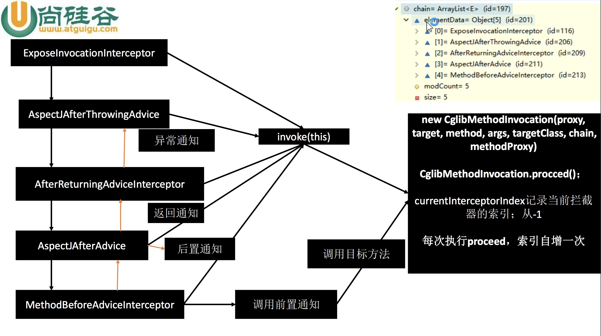

# Spring AOP

AOP：【动态代理】
`指在程序运行期间动态的将某段代码切入到指定方法指定位置进行运行的编程方式；`

## AOP 使用

1、导入aop模块；Spring AOP：(spring-aspects)

2、定义一个业务逻辑类（MathCalculator）；在业务逻辑运行的时候将日志进行打印（方法之前、方法运行结束、方法出现异常，xxx）

3、定义一个日志切面类（LogAspects）：切面类里面的方法需要动态感知MathCalculator.div运行到哪里然后执行；通知方法：

```
前置通知(@Before)：logStart：在目标方法(div)运行之前运行
后置通知(@After)：logEnd：在目标方法(div)运行结束之后运行（无论方法正常结束还是异常
结束）
返回通知(@AfterReturning)：logReturn：在目标方法(div)正常返回之后运行
异常通知(@AfterThrowing)：logException：在目标方法(div)出现异常以后运行
环绕通知(@Around)：动态代理，手动推进目标方法运行（joinPoint.procced()）
```
			
4、给切面类的目标方法标注何时何地运行（通知注解 **@Pointcut**）；

5、将切面类和业务逻辑类（目标方法所在类）都加入到容器中;

6、必须告诉Spring哪个类是切面类(给切面类上加一个注解：**@Aspect**)

7、给配置类中加 **@EnableAspectJAutoProxy** 【开启基于注解的aop模式】
> 在Spring中很多的 @EnableXXX; Enable开启某一项功能

**概括为三步：**

```
1）、将业务逻辑组件和切面类都加入到容器中；告诉Spring哪个是切面类（@Aspect）
2）、在切面类上的每一个通知方法上标注通知注解，告诉Spring何时何地运行（切入点表达式）
3）、开启基于注解的aop模式；@EnableAspectJAutoProxy
```

LogAspects切面类

```java
@Aspect
public class LogAspects {
	
	//抽取公共的切入点表达式
	//1、本类引用
	//2、其他的切面引用
	@Pointcut("execution(public int com.atguigu.aop.MathCalculator.*(..))")
	public void pointCut(){};
	
	//@Before在目标方法之前切入；切入点表达式（指定在哪个方法切入）
	@Before("pointCut()")
	public void logStart(JoinPoint joinPoint){
		Object[] args = joinPoint.getArgs();
		System.out.println(""+joinPoint.getSignature().getName()+"运行。。。@Before:参数列表是：{"+Arrays.asList(args)+"}");
	}
	
	@After("com.atguigu.aop.LogAspects.pointCut()")
	public void logEnd(JoinPoint joinPoint){
		System.out.println(""+joinPoint.getSignature().getName()+"结束。。。@After");
	}
	
	//JoinPoint一定要出现在参数表的第一位
	@AfterReturning(value="pointCut()",returning="result")
	public void logReturn(JoinPoint joinPoint,Object result){
		System.out.println(""+joinPoint.getSignature().getName()+"正常返回。。。@AfterReturning:运行结果：{"+result+"}");
	}
	
	@AfterThrowing(value="pointCut()",throwing="exception")
	public void logException(JoinPoint joinPoint,Exception exception){
		System.out.println(""+joinPoint.getSignature().getName()+"异常。。。异常信息：{"+exception+"}");
	}

}
```

## AOP 原理

研究注解的套路:看给容器中注册了什么组件，这个组件什么时候工作，这个组件的功能是什么？

1、@EnableAspectJAutoProxy是什么？

@Import(AspectJAutoProxyRegistrar.class)：

```
给容器中导入AspectJAutoProxyRegistrar
利用AspectJAutoProxyRegistrar自定义给容器中注册bean；BeanDefinetion 
实际上注册时就是下面的类
internalAutoProxyCreator=AnnotationAwareAspectJAutoProxyCreator
```

**给容器中注册一个AnnotationAwareAspectJAutoProxyCreator；**

总结下：
a. @Import 目的是向Spring容器内注册一个Bean

b. AspectJAutoProxyRegistrar 最终会调用
registerOrEscalateApcAsRequired(**AnnotationAwareAspectJAutoProxyCreator.class**, registry, source);注册

所以现在我们来看看AnnotationAwareAspectJAutoProxyCreator 有什么功能?

2、 AnnotationAwareAspectJAutoProxyCreator

AnnotationAwareAspectJAutoProxyCreator
  ->AspectJAwareAdvisorAutoProxyCreator
   ->AbstractAdvisorAutoProxyCreator
    ->AbstractAutoProxyCreator
       implements SmartInstantiationAwareBeanPostProcessor, BeanFactoryAware

**关注后置处理器（在bean初始化完成前后做事情）、自动装配BeanFactory**

`要研究@EnableXXX 要看是否向容器注册了组件,如果注册了组件,就关注组件的功能,功能确认了,这个注解也就明晰了`

`BeanFactoryWare 一定有set方法`

从顶层父类开始查看功能,下面是我们要关注的父类及其方法

    AbstractAutoProxyCreator.setBeanFactory()
    
    AbstractAutoProxyCreator.有后置处理器的逻辑；
    
    AbstractAdvisorAutoProxyCreator.setBeanFactory() -> initBeanFactory()
    
    AnnotationAwareAspectJAutoProxyCreator.initBeanFactory()


### 处理器和Bean的创建过程

1）、传入配置类，创建ioc容器

2）、注册配置类，调用refresh（）刷新容器；

3）、registerBeanPostProcessors(beanFactory);注册bean的后置处理器来方便拦截bean的创建；

	1）、先获取ioc容器已经定义了的需要创建对象的所有BeanPostProcessor
	2）、给容器中加别的BeanPostProcessor
	3）、优先注册实现了PriorityOrdered接口的BeanPostProcessor；
	4）、再给容器中注册实现了Ordered接口的BeanPostProcessor；
	5）、注册没实现优先级接口的BeanPostProcessor；
	6）、注册BeanPostProcessor，实际上就是创建BeanPostProcessor对象，保存在容器中；
	     如何创建BeanPostProcessor呢? 锚点[创建后置处理器的过程]
	7）、把BeanPostProcessor注册到BeanFactory中；
		beanFactory.addBeanPostProcessor(postProcessor);

4）、finishBeanFactoryInitialization(beanFactory);完成BeanFactory初始化工作；创建剩下的单实例bean

[创建普通单实例Bean的过程](./Spring-AOP代码.md#创建普通单实例Bean的过程)


### 后置处理器的作用-创建代理对象

后置处理器 会调用Bean的postProcessBeforeInstantiation(),那么这个方法究竟干了什么呢?

AnnotationAwareAspectJAutoProxyCreator【InstantiationAwareBeanPostProcessor】	的作用：

**后置处理器-BeforeInstantiation** //尝试创建代理对象,失败
1）、每一个bean创建之前，调用postProcessBeforeInstantiation()；

```
1）、判断当前bean是否在advisedBeans中（保存了所有需要增强bean）
2）、判断当前bean是否是基础类型的Advice、Pointcut、Advisor、AopInfrastructureBean，
或者是否是切面（@Aspect）
3）、是否需要跳过
    1）、获取候选的增强器（切面里面的通知方法）【List<Advisor> candidateAdvisors】
    	   判断每一个增强器是否是 AspectJPointcutAdvisor 类型的；就会返回true
    	当前例子中每一个封装的通知方法的增强器是 InstantiationModelAwarePointcutAdvisor；
    	   所以返回false
    
    2）、调用父类方法,返回false
```

对于普通的类postProcessBeforeInstantiation 什么作用都没有.
然后紧接着调用new 创建对象.

2）、**后置处理器-AfterInstantiation** //本质是遍历所有增强器,使用切入点表达式对bean进行适配
postProcessAfterInitialization；
		return wrapIfNecessary(bean, beanName, cacheKey);//包装如果需要的情况下
		1）、获取当前bean的所有增强器（通知方法）  Object[]  specificInterceptors
			1、找到候选的所有的增强器（找哪些通知方法是需要切入当前bean方法的）
			2、获取到能在bean使用的增强器(根据定义的切入点表达式进行判断)。
			3、给增强器排序
		2）、保存当前bean在advisedBeans中；(表示当前bean已经增强处理了)
		3）、如果当前bean需要增强，创建当前bean的代理对象；
			1）、获取所有增强器（通知方法）
			2）、保存到proxyFactory
			3）、创建代理对象：Spring自动决定
				JdkDynamicAopProxy(config);jdk动态代理；
				ObjenesisCglibAopProxy(config);cglib的动态代理；
		4）、给容器中返回当前组件使用cglib增强了的代理对象；
		5）、以后容器中获取到的就是这个组件的代理对象，执行目标方法的时候，代理对象就会执行通知方法的流程；

### 目标方法执行		

容器中保存了组件的代理对象（cglib增强后的对象），这个对象里面保存了详细信息（比如增强器，目标对象，xxx）；

1）、CglibAopProxy.intercept();拦截目标方法的执行 
   `实际上在创建代理的对象的时候就将一系列的拦截器设置进去了`
2）、根据ProxyFactory对象获取将要执行的目标方法拦截器链；
	`List<Object> chain = this.advised.getInterceptorsAndDynamicInterceptionAdvice(method, targetClass);`
	
    	1）、List<Object> interceptorList保存所有拦截器,list长度是5
    		 一个默认的ExposeInvocationInterceptor 和 4个增强器；so 1+4=5
    	2）、遍历所有的增强器，将其转为Interceptor；
    		 关键代码:registry.getInterceptors(advisor);
    	3）、将增强器转为List<MethodInterceptor>；
    		如果是MethodInterceptor，直接加入到集合中
    		如果不是，使用AdvisorAdapter将增强器转为MethodInterceptor；
    		转换完成返回MethodInterceptor数组；

3）、如果没有拦截器链，直接执行目标方法;
	  拦截器链（每一个通知方法又被包装为方法拦截器，利用MethodInterceptor机制）
4）、如果有拦截器链，把需要执行的目标对象，目标方法，
	  拦截器链等信息传入创建一个 CglibMethodInvocation 对象，
	  并调用 Object retVal =  mi.proceed();
5）、拦截器链的触发过程;
    	1)、如果没有拦截器执行执行目标方法，或者拦截器的索引和拦截器数组-1大小一样（指定到了最后一个拦截器）执行目标方法(就是执行了真正的方法)；
    	2)、链式获取每一个拦截器，拦截器执行invoke方法，每一个拦截器等待下一个拦截器执行完成返回以后再来执行；
    	
	  拦截器链的机制，保证通知方法与目标方法的执行顺序；
	  其实利用递归+全局变量(记录调用顺序)+threadLocal
	  


## 总结		

1）、 @EnableAspectJAutoProxy 开启AOP功能

2）、 @EnableAspectJAutoProxy 会给容器中注册一个组件
      AnnotationAwareAspectJAutoProxyCreator

3）、AnnotationAwareAspectJAutoProxyCreator是一个**后置处理器**；

4）、容器的创建流程：`后置处理器怎么工作`
	1）、registerBeanPostProcessors（）注册后置处理器；创建AnnotationAwareAspectJAutoProxyCreator对象
	2）、finishBeanFactoryInitialization（）初始化剩下的单实例bean
		1）、创建业务逻辑组件和切面组件
		2）、AnnotationAwareAspectJAutoProxyCreator拦截组件的创建过程
		3）、组件创建完之后，判断组件是否需要增强
			是：切面的通知方法，包装成增强器（Advisor）;给业务逻辑组件创建一个代理对象（cglib）；
			
5）、执行目标方法：
	1）、代理对象执行目标方法
	2）、CglibAopProxy.intercept()；
		1）、得到目标方法的拦截器链（增强器包装成拦截器MethodInterceptor）
		2）、利用拦截器的链式机制，依次进入每一个拦截器进行执行；
		3）、效果：
			正常执行：前置通知-》目标方法-》后置通知-》返回通知
			出现异常：前置通知-》目标方法-》后置通知-》异常通知
	

