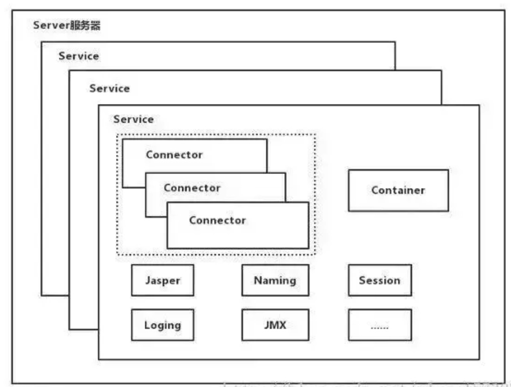

##tomcat 容器结构

结构图

Server可以有多个Service
Service主要包含两个部分：Connector和Container

```
1.Connector用于处理连接相关的事情，并提供Socket和Request和Response相关的转化
2.Container用于封装和管理Servlet，以及具体处理Request请求
```

**tomcat架构总结**

*（1）Tomcat中只有一个Server，一个Server可以有多个Service，一个Service可以有多个Connector和一个Container；

*（2）Server掌管着整个Tomcat的生死大权；

*（4）Service 是对外提供服务的；

*（5）Connector用于接受请求并将请求封装成Request和Response来具体处理；

*（6）Container用于封装和管理Servlet，以及具体处理request请求；

>一个Service只有一个Container，但是可以有多个Connectors，这是因为一个服务可以有多个连接，
如同时提供Http和Https链接

配置文件的图


##Connector
Connector最底层使用的是Socket来进行连接的，Request和Response是按照HTTP协议来封装的，所以Connector同时需要实现TCP/IP协议和HTTP协议

1.Connector如何接受请求的
2.如何将请求封装成Request和Response
3.封装完成之后的Requst和Response如何交给Container进行处理的？
4.Container处理完之后如何交给Connector并返回客户端的？


##Container


下面找一个Tomcat的文件目录对照一下，如下图所示：


1.Engin:引擎，用来管理多个站点，一个Service最多只能有一个Engine
2.Host:代表一个站点，也可以叫虚拟机，通过配置Host能添加站点
3.Context:代表一个应用程序，对应着平时开发一套程序或者一个WEB-INF目录以及下面的web.xml文件
4.Wrapper:每一个Wrapper封装着一个Servlet


Container处理请求是使用Pipeline-Valve管道来处理

Pipeline-Valve是责任链模式，责任链模式是指在一个请求处理的过程中有很多处理者依次对请求进行处理，
每个处理者负责做自己相应的处理，处理完之后将处理后的请求返回，再让下一个处理着继续处理。

**四个子容器**
我们知道Container包含四个子容器，而这四个子容器对应的BaseValve分别在：
StandardEngineValve、StandardHostValve、StandardContextValve、StandardWrapperValve

处理过程图

**请求处理的具体过程**

```
（1）Connector在接收到请求后会首先调用最顶层容器的Pipeline来处理，这里的最顶层容器的Pipeline就是EnginePipeline（Engine的管道）；

（2）在Engine的管道中依次会执行EngineValve1、EngineValve2等等，最后会执行StandardEngineValve，在StandardEngineValve中会调用Host管道，然后再依次执行Host的HostValve1、HostValve2等，最后在执行StandardHostValve，然后再依次调用Context的管道和Wrapper的管道，最后执行到StandardWrapperValve。

（3）当执行到StandardWrapperValve的时候，会在StandardWrapperValve中创建FilterChain，并调用其doFilter方法来处理请求，这个FilterChain包含着我们配置的与请求相匹配的Filter和Servlet，其doFilter方法会依次调用所有的Filter的doFilter方法和Servlet的service方法，这样请求就得到了处理！

（4）当所有的Pipeline-Valve都执行完之后，并且处理完了具体的请求，这个时候就可以将返回的结果交给Connector了，Connector在通过Socket的方式将结果返回给客户端
```