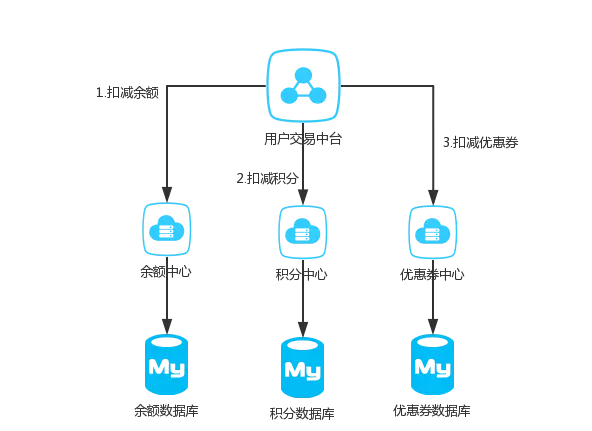
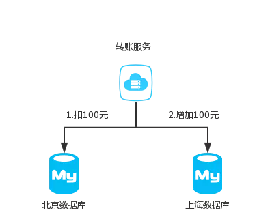
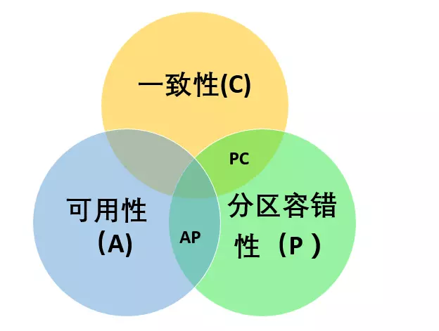
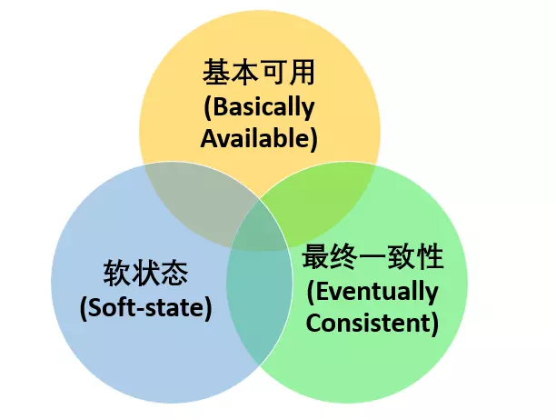

### 为什么需要分布式事务
-------
* service多个节点
* resource多个节点
这两种情况都会产生分布式事务

##### service多个节点
随着互联网快速发展，微服务，SOA等服务架构模式正在被大规模的使用，
举个简单的例子，一个公司之内，用户的资产可能分为好多个部分，比如余额，积分，优惠券等等。
在公司内部有可能积分功能由一个微服务团队维护，优惠券又是另外的团队维护。
这样的话就无法保证积分扣减了之后，优惠券能否扣减成功。



##### resource多个节点
同样的，互联网发展得太快了，我们的Mysql一般来说装千万级的数据就得进行分库分表，
对于一个支付宝的转账业务来说，你给的朋友转钱，有可能你的数据库是在北京，
而你的朋友的钱是存在上海，所以我们依然无法保证他们能同时成功。




### 基本概念
-----------

##### ACID和CAP（布鲁尔定理）

* 原子性/一致性（两者相同）/隔离性/持久性
* 一致性/可用性/分区容错性


##### CAP必选项？
-------
分区容错性是必选项。对于分布式系统，始终要假设网络是不稳定的。
所以我们是在CP和AP是进行选择和妥协。



##### BASE理论
-------
>BASE 是 Basically Available（基本可用） 、Soft-state（软状态） 和 Eventually Consistent（最终一致性） 三个短语的缩写。

BASE理论是对CAP中一致性和可用性权衡的结果，是对CAP中AP的一个扩展。
采用适当的方式来使系统达到最终一致性。牺牲数据的一致性来满足系统的高可用性。

```
1.基本可用:分布式系统在出现故障时，允许损失部分可用功能，保证核心功能可用。
2.软状态:允许系统中存在中间状态，这个状态不影响系统可用性，这里指的是CAP中的不一致。
3.最终一致:最终一致是指经过一段时间后，所有节点数据都将会达到一致。
```



### 分布式事务协议
-------

##### 两阶段提交协议（2PC：Two-Phrase Commit）
>两阶段提交主要保证了分布式事务的原子性：即所有结点要么全做要么全不做
>第一阶段：准备阶段(投票阶段)和第二阶段：提交阶段（执行阶段）

**二阶段提交的算法思路可以概括为：参与者将操作成败通知协调者，再由协调者根据所有参与者的反馈情报决定各参与者是否要提交操作还是中止操作**

问题：
```
1、同步阻塞问题。 执行过程中，所有参与节点都是事务阻塞型的。当参与者占有公共资源时，其他第三方节点访问公共资源不得不处于阻塞状态。

2、单点故障。由于协调者的重要性，一旦协调者发生故障。参与者会一直阻塞下去。尤其在第二阶段，协调者发生故障，那么所有的参与者还都处于锁定事务资源的状态中，而无法继续完成事务操作。（如果是协调者挂掉，可以重新选举一个协调者，但是无法解决因为协调者宕机导致的参与者处于阻塞状态的问题）

3、数据不一致。在二阶段提交的阶段二中，当协调者向参与者发送commit请求之后，发生了局部网络异常或者在发送commit请求过程中协调者发生了故障，这回导致只有一部分参与者接受到了commit请求。而在这部分参与者接到commit请求之后就会执行commit操作。但是其他部分未接到commit请求的机器则无法执行事务提交。于是整个分布式系统便出现了数据部一致性的现象。

4、二阶段无法解决的问题。协调者再发出commit消息之后宕机，而唯一接收到这条消息的参与者同时也宕机了。那么即使协调者通过选举协议产生了新的协调者，这条事务的状态也是不确定的，没人知道事务是否被已经提交。

```


##### 三阶段提交协议（3PC：Three-Phrase Commit）

>1、引入超时机制。同时在协调者和参与者中都引入超时机制。
>2、在第一阶段和第二阶段中插入一个准备阶段。保证了在最后提交阶段之前各参与节点的状态是一致的

也就是说，除了引入超时机制之外，3PC把2PC的准备阶段再次一分为二，这样三阶段提交就有CanCommit、PreCommit、DoCommit三个阶段

2PC与3PC的区别
```
相对于2PC，3PC主要解决的单点故障问题，并减少阻塞，因为一旦参与者无法及时收到来自协调者的信息之后，他会默认执行commit。
而不会一直持有事务资源并处于阻塞状态。但是这种机制也会导致数据一致性问题，因为由于网络原因，协调者发送的abort响应没有及时被参与者接收到，
那么参与者在等待超时之后执行了commit操作。
这样就和其他接到abort命令并执行回滚的参与者之间存在数据不一致的情况
```


### 分布式事务的解决方案
-------

##### TCC（TCC：Try-Confirm-Cancel）
对于TCC的解释:
```
Try阶段：尝试执行,完成所有业务检查（一致性）,预留必须业务资源（准隔离性）

Confirm阶段：确认执行真正执行业务，不作任何业务检查，只使用Try阶段预留的业务资源，Confirm操作满足幂等性。要求具备幂等设计，Confirm失败后需要进行重试。

Cancel阶段：取消执行，释放Try阶段预留的业务资源
Cancel操作满足幂等性Cancel阶段的异常和Confirm阶段异常处理方案基本上一致。
```
举个简单的例子如果你用100元买了一瓶水，
  Try阶段:你需要向你的钱包检查是否够100元并锁住这100元，水也是一样的。
  如果有一个失败，则进行cancel(释放这100元和这一瓶水)，如果cancel失败不论什么失败都进行重试cancel，所以需要保持幂等。
  如果都成功，则进行confirm,确认这100元扣，和这一瓶水被卖，如果confirm失败无论什么失败则重试(会依靠活动日志进行重试)
  
对于TCC来说适合一些:
  强隔离性，严格一致性要求的活动业务。
  执行时间较短的业务

**TCC和两阶段分布式事务处理的区别**
2PC一个完整的事务生命周期是：begin -> 业务逻辑 -> prepare -> commit。
TCC一个完整的事务生命周期是：begin -> 业务逻辑(try业务) -> commit(comfirm业务)。

综上，我们可以从执行的阶段上将二者一一对应起来：
```
1、 2PC机制的业务阶段 等价于 TCC机制的try业务阶段；
2、 2PC机制的提交阶段（prepare & commit） 等价于 TCC机制的提交阶段（confirm）；
3、 2PC机制的回滚阶段（rollback） 等价于 TCC机制的回滚阶段（cancel）。
```
##### 基于可靠消息服务的分布式事务
https://juejin.im/post/5aa3c7736fb9a028bb189bca#heading-13

[参考]https://juejin.im/post/5affcf6bf265da0b95275e57?utm_source=gold_browser_extension
[参考]https://juejin.im/post/5b5a0bf9f265da0f6523913b?utm_source=gold_browser_extension
[参考]http://www.cnblogs.com/hxsyl/p/4381980.html
[参考]http://www.hollischuang.com/archives/681
[参考]https://juejin.im/post/5aa3c7736fb9a028bb189bca#heading-13
